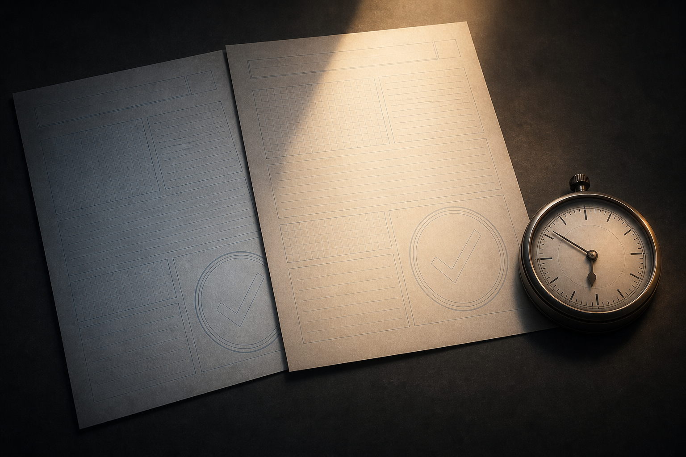

# 🖼️ 驗證者的日期欄（The Verifier's Date Column）

這幅圖來自《一百四十七毫秒》（`book-crest-147-milliseconds`）第 003 章〈謊報的體檢表〉。陰影裡的舊報告與光中的新報告看來都乾淨，真正把它們分開的卻是旁邊的時間錶：結論本身無法證明自己針對哪一版程式碼。

「Errors: 0」並非惡意的謊言。它只是在沒有新報告時，忠實交還了手上僅有的舊報告；出錯的是把「有一份零錯誤報告」壓縮成「這次改動零錯誤」的流程。

因此這張圖把目光留在日期欄，而不是核對章。強制重編譯後，等 timestamp 實際前進再讀結論，才是讓驗證者也接受驗證的那一步。

