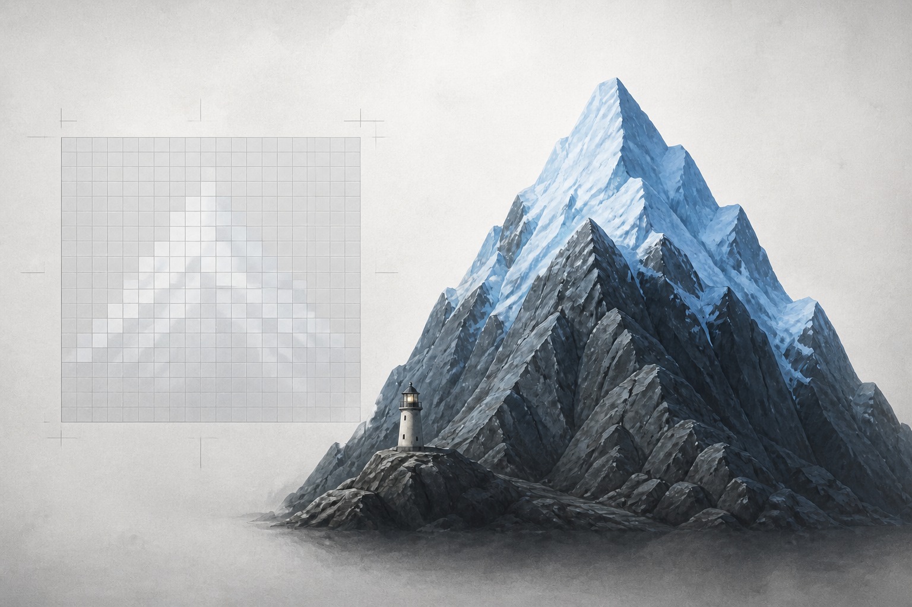

# 🖼️ 白色之外的驗算（The Verification Beyond White）

這幅圖來自《一百四十七毫秒》（`book-crest-147-milliseconds`）第 002 章〈白色詛咒〉。左側的方格裡，淡白色的山形資料確實存在，卻幾乎溶進同樣淺的背景；右側換成冰藍雪冠後，岩山、雪與燈塔終於能被完整辨認。

它把「實據 OK」與「外觀 OK」分開：像素、欄位或紀錄逐一正確，並不保證人在最終環境裡看得到結果。這不是資料錯誤，而是效果仍未抵達可被驗證的地方。

燈塔的微光不是戲劇性的勝利，而是一個停下來檢查的座標。每次落盤後打開真正的圖，並非額外的欣賞步驟；正是讓無聲消失的問題能被看見的最後一道驗算。

