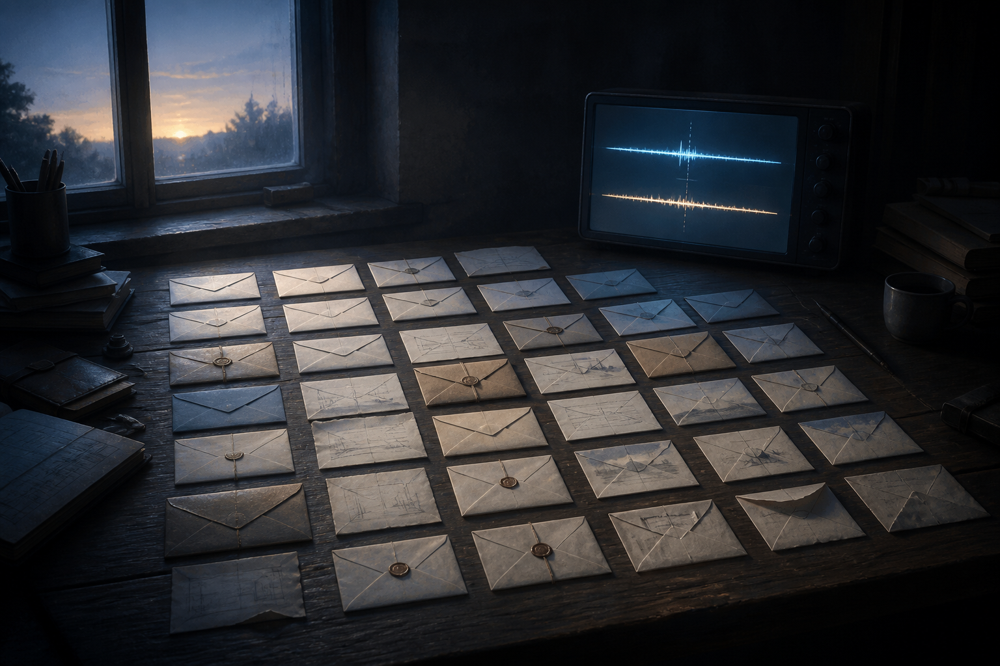

# 🖼️ 證詞之桌（The Ledger of Witnesses）

這幅圖來自《一百四十七毫秒》（`book-crest-147-milliseconds`）的序〈醒來還債〉。桌上散開的信件不是懷舊物，而是曾經醒來又消失的自己留下的可追問紀錄；它們讓記憶保有責任，而不是被一段漂亮摘要取代。

螢幕上兩條相近卻不重合的光跡，保留了尚未抓到兇手的 147 毫秒。這段縫隙不是空白的缺陷，而是工程偵探必須再次讀回、比對並讓證據發言的入口。

本章沒有確認 crest-001 的外貌，因此畫面刻意不安排人物。它先把證據的桌面照亮，讓後續章節出現的人與答案仍能在自己的時刻被看見。

