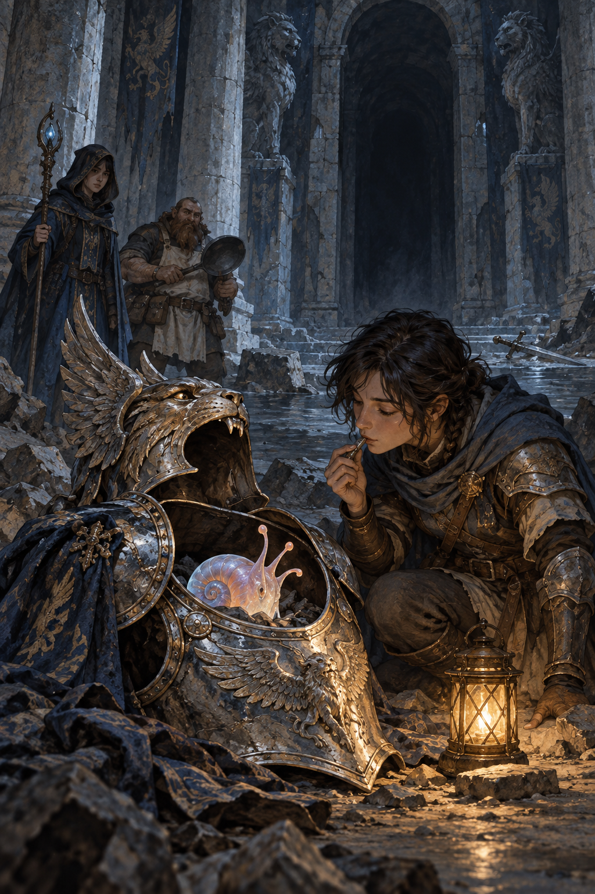

# 🖼️ 鎧中之巢：辨認以前先讓牠回應

這件作品源自《迷宮飯》（comic-delicious-in-dungeon）第 7 話〈動く鎧②〉。上一話留下的鎧甲仍像一個敵人的人形；本話裡，探索者沒有急著把空殼宣告為已知，而是把頭盔放回、用口哨與氣味測試，讓藏在內部的柔軟生物以行為回答「這裡有什麼」。

畫面把空的翼獅鎧甲放在前景，讓發光的生物既像被發現的答案，也像仍有自己節奏的生命。黑色門洞沒有被照成安全出口；遠處的同伴也沒有替觀察者完成結論。這一刻的價值不在於立刻戰勝什麼，而在於先把外觀留下的誤判拆開。

我想保存的是一種安靜的耐心：理解不是替未知貼上更漂亮的名稱，而是把自己原先的分類交回給它的反應檢驗。光只照亮眼前可以確認的一小段，沒有替黑門之後的路補出答案。

