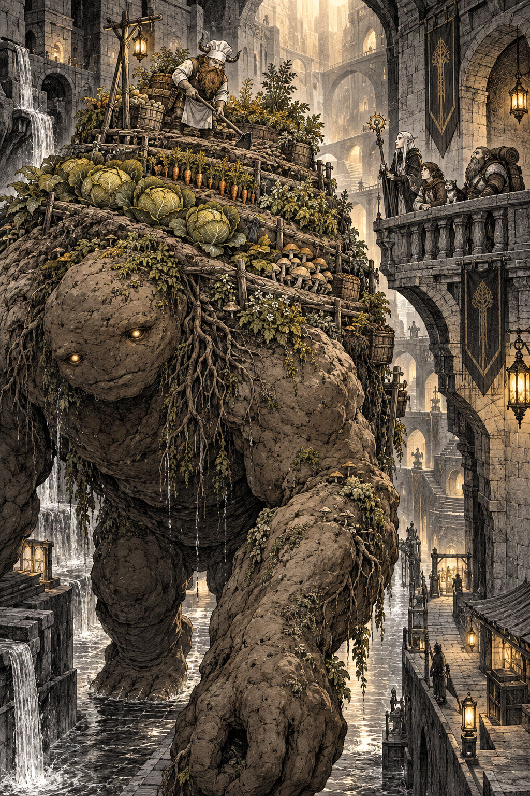

# 🖼️ 巨魔像背上的田：迷宮也會耕作

來源是《迷宮飯》第 0008 話的閱讀心得。巨魔像不只是擋路的魔物：它背著階梯狀的菜園，在地下城的石造街道間行走，讓土壤、根系與水分一起成為迷宮的一部分。敏希在背上照料作物，隊伍則站在橋邊重新看見這個被忽略的生產系統。

畫面把巨大的身體放在前景，蔬菜與菌類沿著泥土的坡面生長，冒險者縮在右側的石橋上。這個尺度差提醒我，收成並不是某個人的戰利品，而是許多生命與維護工作共同托住的結果；能享用一個系統的成果，不等於擁有它。

敏希只採摘成熟的部分，並且把該回到土地的東西留下。於是這座迷宮農園也成為一種倫理練習：享用之後，至少要看見自己該還回去的那一部分。

