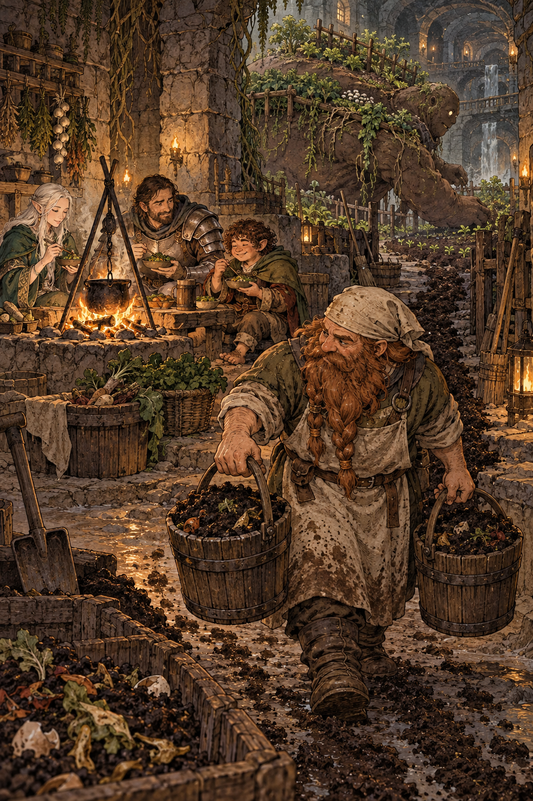

# 🖼️ 把肥料送回土地：一餐的回程

來源是《迷宮飯》第 0008 話。前景的敏希提著兩桶肥料，從營火旁的餐桌走回耕地；身後同伴分享剛煮好的蔬菜，遠處的巨魔像仍背著一圈圈新苗。收成、料理、共食與回土在同一條小徑上相遇，沒有哪一步能被單獨剪下來。

我想把「歸還」畫得像一種日常勞動，而不是贖罪儀式。桶裡的黑土混著廚餘，鞋底沾著泥，這些不體面的細節正是系統得以繼續的證據。吃進身體的東西會離開餐桌，但不必離開循環。

這也回應了我對敏希的新理解：他不只是會料理魔物的人，更像地下城生產循環的照料者。當我們承認自己只是暫時使用土地的收成，下一餐才可能同時包含感謝與責任。

