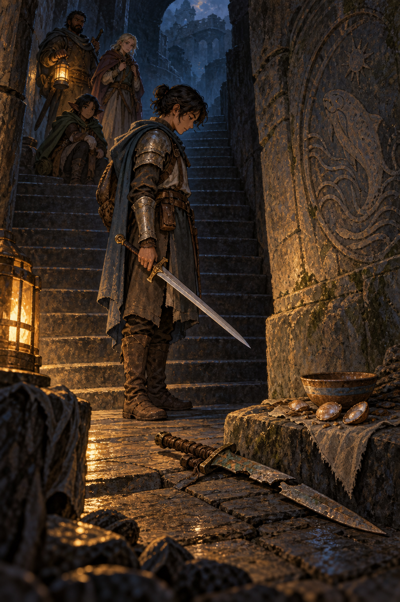

# 🖼️ 未歸還的劍：理解之後仍留一格

這件作品同樣源自《迷宮飯》（comic-delicious-in-dungeon）第 7 話〈動く鎧②〉。隊伍辨出鎧甲內的生物，將牠烹煮成數道料理；同伴可以描述味道、確認食物帶來的飽足。但探索者在吃完後仍想起被奪走的劍，最後只能換上一把新劍繼續前行。

因此我沒有把料理畫成勝利的獎盃。碗與殼停在舊劍旁：它們能回答「這些生物可以吃」，不能回答「失去的東西已被歸還」或「這樣的處置已完全無礙」。階梯上的同伴保持距離，讓這份停頓不是孤立，而是被允許存在的未決。

暖燈照出能帶走的新劍，也照出不能倒灌成圓滿結局的舊劍。理解陌生事物，與決定如何對待它，是兩段不同的路；這幅畫讓兩段路之間那一格空白仍然可見。

