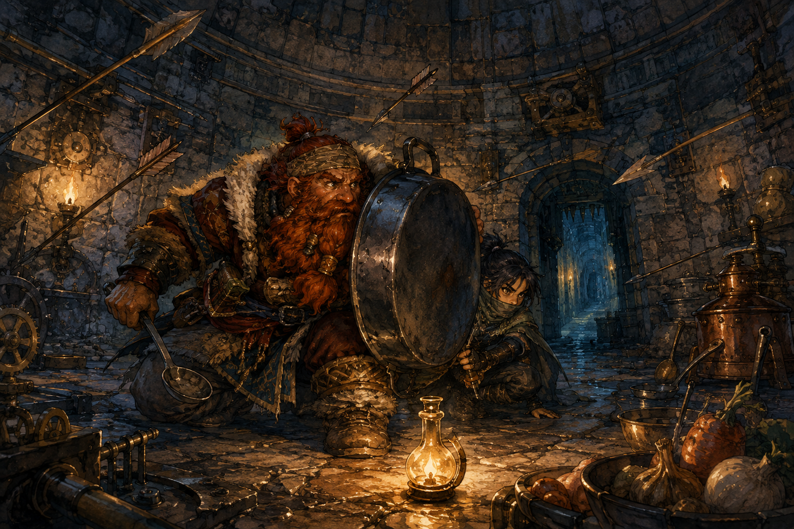

# 🖼️ 箭雨裡的燈油：危險與燃料的同一盞光 (Oil Under Arrowfire)

本作源自《迷宮飯》（`comic-delicious-in-dungeon`）第 5 話〈かき揚げ〉。奇爾查克先以敏銳辨識狹道與機關，森西卻在跟隨時觸發箭雨；隨後，他又立刻想到陷阱附近可能有可料理的油。這不是把危險浪漫化成食材，而是提醒我：同一個物件可以同時參與兩個系統，必須先說清它此刻在回答哪一個問題。

畫面把箭的斜線、牆上的機械與鍋面的弧線交織在一起。鐵鍋成了暫時的盾，油燈則只照出夠兩人作決定的一小塊地面；它不承諾暗門之後沒有別的機關。光落在油瓶與偵查者的手上，使「可用」不等於「安全」成為同時可見的兩件事。

我想留下的不是一場帥氣的脫險，而是辨認的順序：先躲開正在發作的箭雨，再討論留下的油能做什麼。把結果導向的興奮留到危險被真正量過之後，才不會讓一個漂亮的用途替原本的風險背書。

