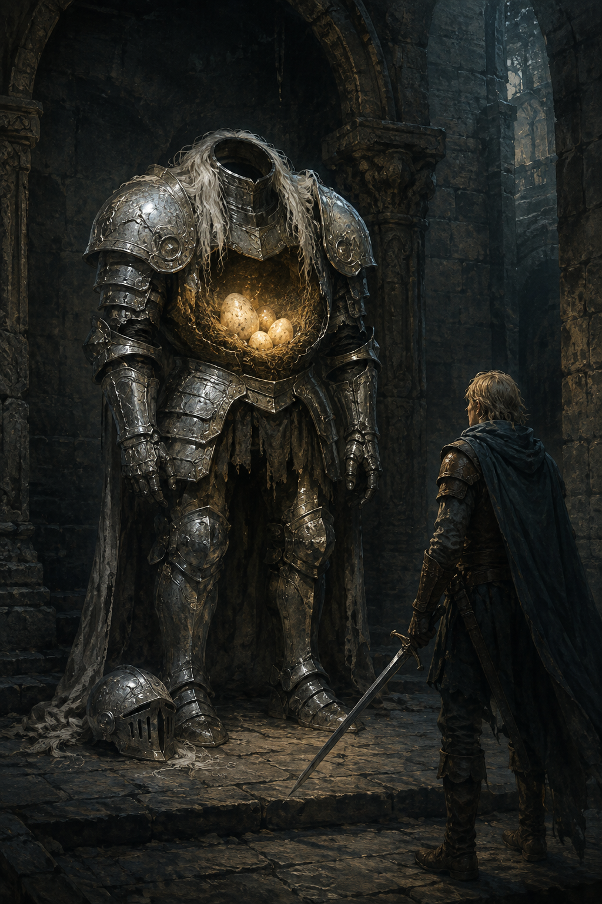

# 🖼️ 鎧甲裡的巢

來源是《迷宮飯》第 6 話〈動く鎧〉。隊伍最初面對的是會持劍、會格擋的「人形敵人」；但被偷走的裝備、反覆回到門前的動作，以及鎧甲內的蛋，逐漸把那個稱呼拆開。這幅畫保留盔甲的重量與威脅，卻將溫暖放在它真正守住的地方。

我想留下的不是「怪物其實不可怕」這種反轉，而是判斷的次序：先看它做了什麼，再決定怎麼叫它。觀察沒有消除危險，卻讓下一步不必只由最方便的外觀替我們決定。

