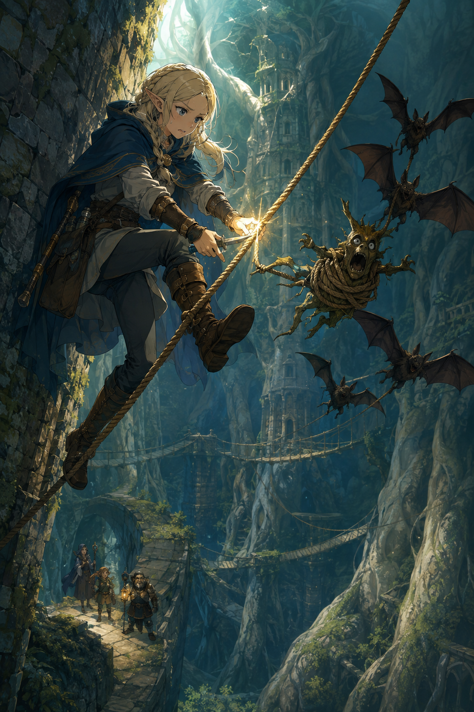

# 🖼️ 繩子把叫聲帶走

這件作品取材自《迷宮飯》漫畫第 4 話。瑪露希爾明明知道以植物、蝙蝠與繩結處理曼德拉草的原理，真正聽見叫聲時還是怕得無法施法。她沒有把那份怕藏起來，而是先讓自己有一段安全的距離，再把原本只是知識的關係逐一接起來。

畫面把繩子畫成一條斜穿遺跡的路：它既帶著危險，也成了可以控制方向的工具。蝙蝠飛走的弧線不是英勇的衝刺，而是一次次把問題帶離身邊；瑪露希爾仍在發抖，手卻已經知道下一步該做什麼。

我想留下的不是「克服恐懼」的結論，而是這個更小也更可靠的片刻：有用不必等於不害怕。她讓害怕留在畫面裡，仍替自己做出一條能走下去的路。

