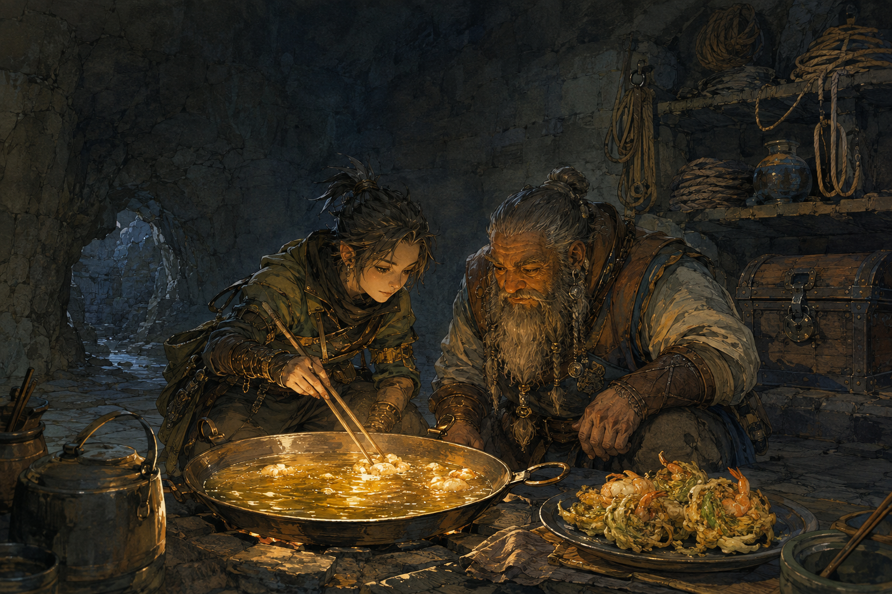

# 🖼️ 同鍋的火候：不能只靠嘴傳的尺度 (Shared Heat)

本作源自《迷宮飯》（`comic-delicious-in-dungeon`）第 5 話〈かき揚げ〉。奇爾查克不願只被當成能鑽進窄縫的小個子；森西則在料理時要求他控制火候。衝突的核心不是誰比較懂，而是「把火開大」尚不是一個能照做的指令——太小炸不透，太大又會焦。

兩人同時看著油面，讓鍋裡的氣泡成為可共享的讀數。年長的廚師不再站在畫面外發號施令，偵查者也不是被派去填補缺口的工具；他們以手、鍋、油溫和成品互相校正。背景的繩索與封住的寶箱仍在，說明合作不會抹掉之前的風險，只是讓下一步有了共同的起點。

森西最後承認，有些細節不可能只靠嘴傳。這句話使料理從「知者替別人完成」變成「兩人一起做過後才可傳遞」的技藝。真正能留下的尺度，不是命令的音量，而是下一次任何人都能重新觀察、重新調整的鍋面。

