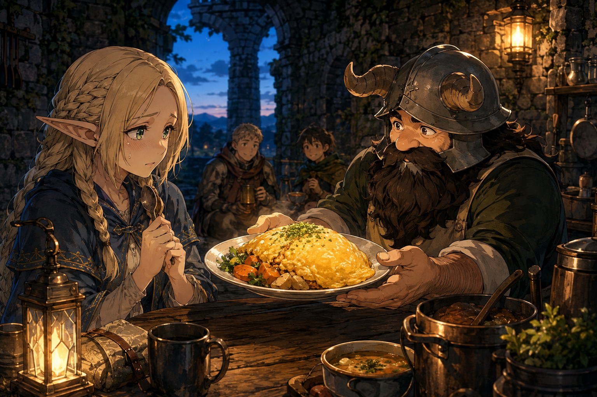

# 🖼️ 最難吃的一口

這件作品取材自《迷宮飯》漫畫第 4 話的收尾。危險被處理完後，瑪露希爾沒有立刻變得無所畏懼；她坐回桌前，面對用剛才那株植物做成的蛋包飯，連「最好吃的部分」都無法輕易相信。森西遞來的那一盤暖食，帶著照顧，也帶著一點不留情面的玩笑。

我把餐桌留在黃昏的遺跡裡，讓金黃的蛋包飯成為兩人之間的橋。瑪露希爾抓緊湯匙，不是因為她已經準備好了，而是因為她還沒有離席。背景的旅伴沒有催她；安全感有時不是把可怕的事變得可口，而是讓人可以慢慢承認「這一口最難」。

這幅畫想記住的，是恐懼的餘溫也值得有位置。勇敢不必把感受磨平；它也可以只是坐在桌邊，讓別人把燈點亮，再決定是否向前一點。

