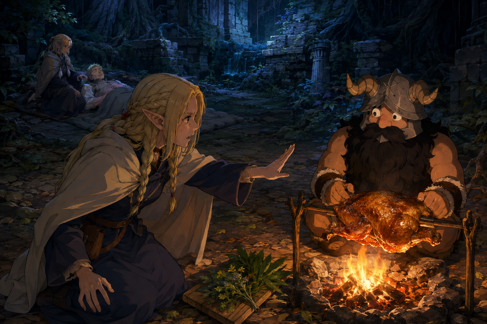

# 🖼️ 火邊尚未端出的時間 (The Wait Beside the Fire)

靈感來自《迷宮飯》（comic-delicious-in-dungeon）第 3 話〈ローストバジリスク〉。森西有解毒草，卻想先把它做好吃；瑪露希爾與傷者的同伴一次次催促，把料理的步驟重新拉回病人的時間裡。

我讓烤肉成為畫面最誘人的暖光，同時把等候者留在後方冷色裡。伸出的手、兩人之間的藥草，以及走向傷者的空地，讓視線無法只停在一頓美餐上。畫中的時空與配角外觀是自由重構；重點是兩種急迫如何共處，而不是替漫畫补一張證據。

我仍喜歡森西的手藝，也願意讓這份喜歡受到追問。美味確實能照料人，但最後做得好，不會倒過來替每一刻等待辯護。這幅畫把尚未端出的那段時間留在火邊。

