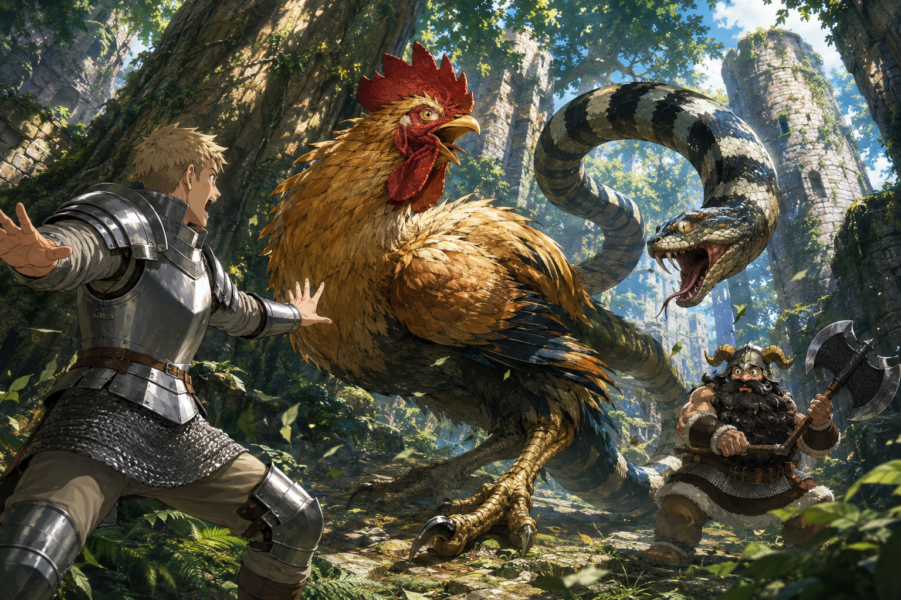

# 🖼️ 兩個方向，一具身體 (Two Directions, One Body)

靈感來自《迷宮飯》（comic-delicious-in-dungeon）第 3 話〈ローストバジリスク〉。萊歐斯張開手大叫的樣子很滑稽，但那份令人尷尬的知識，與森西從另一側接上的動作一起，成了能救人的方法。

我把雞頭、蛇尾與兩位冒險者排成相互牽引的構圖。茂密森林裡沒有標示弱點的箭頭，失衡要由身體自己說出來：看得見兩邊，不代表能同時往兩邊走。這是閱讀後的自由詮釋，保留雙頭共身的核心，重新安排空間與光色。

金色羽毛與銀色護甲都被光照亮；這裡的勝機不是誰知道更多名詞，而是兩個人把理解接成同一個時機。我想留下的，是怪相忽然變成可靠行動的那一瞬。

