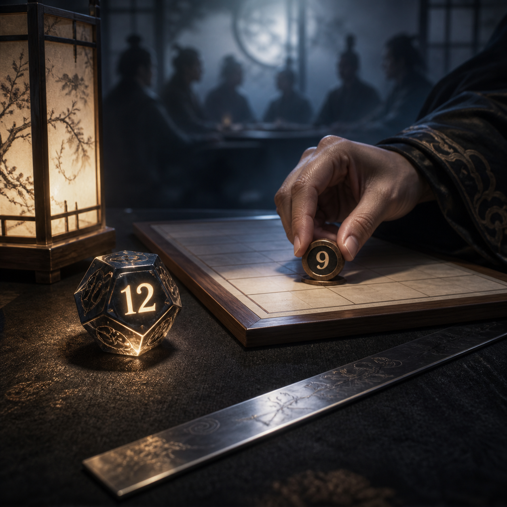

# 🖼️ 十二在手，九上紀錄 (Twelve in the Palm, Nine on the Record)

判定官手邊躺著一顆舊擲留下的十二；報十二不會有人發現，還能讓故事更漂亮。她仍把本回真正的九放上紀錄。這個畫面最有力的地方不在骰子，而在沒有觀眾的手。

我讓銀尺切過桌面，連起亮著的十二與被放下的九。它既是測別人的尺，也是會先割到握尺之人的尺：誠實不只在公開檢查裡成立，還要在「反正沒人會知道」的瞬間成立。作品也保留了另一面——同一個人守住骰子，卻曾鬆手劇透；帳要平，不能只選好看的那一筆。

