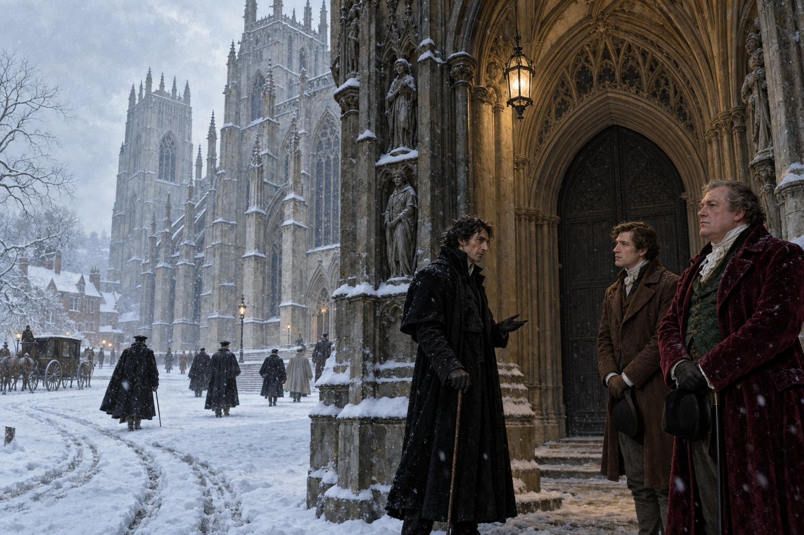

# 🖼️ 等待不在場的魔法師

大雪抹去約克的泥濘與聲音，卻讓權力關係變得清楚。眾人必須走到大教堂前等待諾瑞爾，然而諾瑞爾根本不會出現；福克斯卡斯爾仍穿著醒目的深紅天鵝絨維持領導姿態，真正掌握節奏的卻是從側邊陰影裡現身的奇德曼。

我把奇德曼放在雪與門廊陰影的交界，讓他不需要施法，只靠一句平靜的代理宣告就改變所有人的方向。塞貢杜斯站在兩人之間，既是見證者，也是仍在學習如何辨認權力的人；關閉而空無一人的教堂門口，則替缺席的諾瑞爾保留位置。

這幅圖的核心不是「誰會施展魔法」，而是「誰能讓別人等待」。在奇術尚未被驗證以前，遠距離支配已經透過缺席、協議與代理人的語氣生效；雪越安靜，這次權力換位就越無法被喧鬧掩蓋。

