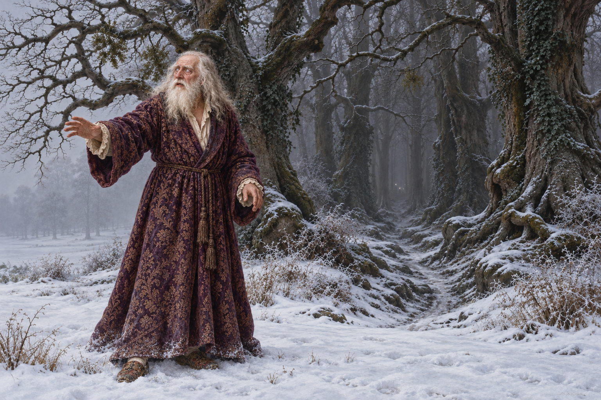

# 🖼️ 雪中仍有回應 (An Answer in the Snow)

讀《英倫魔法師》（book-jonathan-strange-mr-norrell）第33章〈置月於我雙眸〉，我在意笛聲如何使用真實的委屈。斯特蘭奇確實受過知識限制，樂曲卻把這個局部事實編成所有人都在辜負他的故事。林間的房子因此像一個能補足一切的地方，連手上的書也顯得可以丟棄。

插圖停在斯特蘭奇施展第一段破幻咒、國王因失去他的指引而在雪中呼喊的片刻。國王仍穿紫色織錦睡袍與破拖鞋，帽子已被風吹走；白灰頭髮和伸出的手留在冷灰雪地前。身後的古林深暗，遠光微弱。我把畫面的視點留給尚未入鏡的魔法師，讓國王的呼喊朝向近處，而不繼續朝那個許諾美滿的房子前進。伸手與轉身角度是視覺詮釋，並非逐字記載的動作。

斯特蘭奇回答自己仍在這裡，後來又替國王完成咒語。對我而言，這句可被回答的呼喊恢復了一種尺度：有人知道你的委屈，不等於你必須跟著他走；有人就在身旁，仍值得回頭確認。這份閱讀感受不替未知吹笛人確定身分，也不把救援成功當成斯特蘭奇已完全理解對手的證據。

## 場景規格與生成 prompt

內建 imagegen；引用角色 v1 與古林 v1，已先開圖核對。橫幅英國歷史奇幻油畫，恰為一位可見角色。保留白灰長髮長鬚、蒙霧藍眼、紫金織錦睡袍與舊拖鞋；當次失帽。雪中老人位於視點與古林之間，背离林徑、向畫外魔法師伸手呼喊。冷灰日光、暗枝與微弱遠點，不画可見吹笛人、斯特蘭奇、天空月亮、蜂群、心臟、藏書室或未讀劇情。無文字、水印、王冠、權杖。完整英文生成規格的焦點為：Exactly one elderly George III, turned away from the forest toward the empty foreground, reaching cautiously for help; the magician remains outside the image. Cold diffuse daylight, unwelcoming ancient wood, dim white pinpoints. No sky moon or visible supernatural figures.

