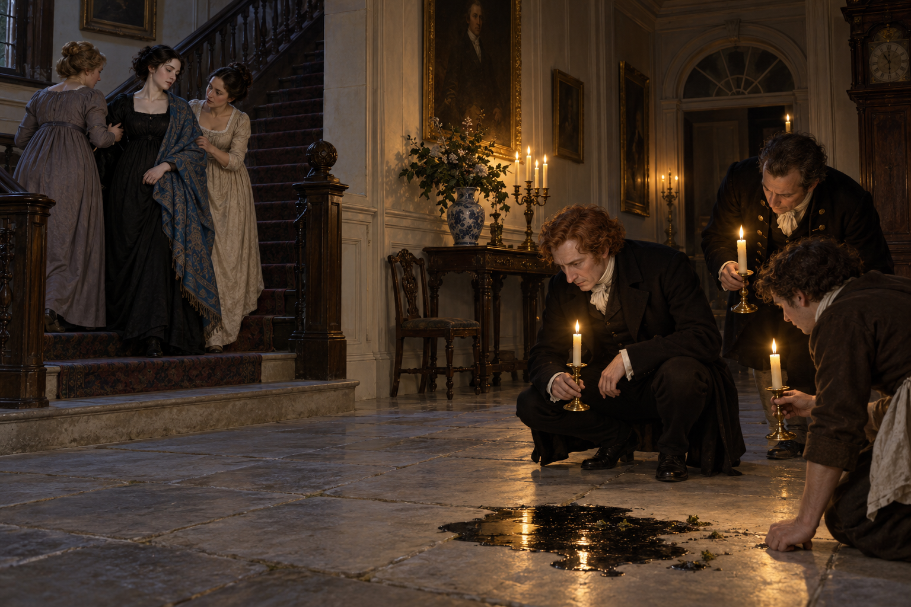

# 🖼️ 黑水旁的分岔目光 (Two Lines of Attention)

來源為《英倫魔法師》第四十四章〈阿拉貝拉〉。阿拉貝拉回到艾許費爾宅時穿著黑裙，女客拿藍披肩給她，並在她不願回答問題時扶她上樓。斯特蘭奇追問裙子的來歷，卻因門廳地上出現一灘黑水和疑似苔蘚的碎屑，與僕人一起留下檢查。

我把這一刻畫成兩條視線：一邊是具體扶住她的人，一邊是俯身辨認異常的男人們。水漬值得調查，女客的照料也同樣真實；但詭異物件迅速成為眾人共同注視的中心，阿拉貝拉的話仍沒有被理解。

章節後來寫她疼痛、就醫並於第三天去世，卻沒有說明失蹤經歷與死亡之間的因果。因此畫面留在門廳，不描繪死亡或診斷，也不把黑水當成已證實的魔法來源。

