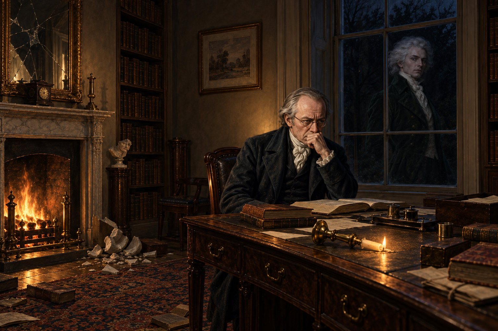

# 黑窗裡的兩種盤算

第十八章裡，沃特爵士一連詢問醫生、大臣與諾瑞爾，想弄清坡夫人為何忽然蒼白、沉默、畏寒。貝利先生把她的異狀套進新婚夫妻的爭執；大臣們則把答案推給救活她的魔法。諾瑞爾先說精神上的異常不歸魔法與醫學管，最後在自己的書房質問黑窗倒影中的銀髮男子，才說出他真正掛心的是沃特爵士能否繼續替英格蘭魔法出力，並不在意坡夫人的幸福。

我讀到的不是哪一種診斷終於勝出，而是每個人都把坡夫人的痛苦折進自己熟悉的框架。她本人幾乎沒有發言位置；醫生、大臣和魔法師談論她時，各自在保護專業、宗教信念或政治盤算。章末那場爭執尤其刺耳：男子聲稱履行了契約、讓她與尊重她的人在一起；諾瑞爾反駁的重點卻不是她受了什麼，而是這件事如何影響自己借助沃特爵士推動的事業。

畫面停在諾瑞爾的黑窗書房：他坐在書桌前，不肯轉身，銀髮男子只出現在夜色玻璃的倒影裡；碎裂的牆鏡、陶瓷胸像與傾倒的燭台留在爭執之後。兩個人各自以為掌握事情的解釋權，但坡夫人的感受仍不在房間裡。不替倒影定性，也不替任何人補上自稱之外的動機。

