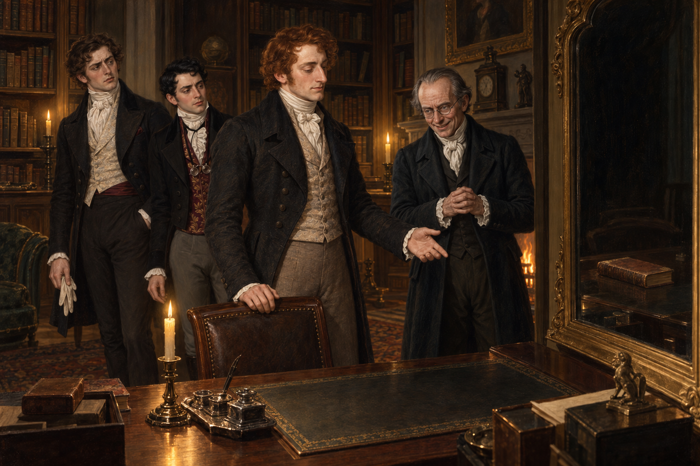

# 鏡中的書，鏡外的欣喜

斯特蘭奇在諾瑞爾書房裡一時找不到能展示的法術，視線落到角落的鏡子與桌上的書。他做了一個自己也說不清的動作，接著那本書的實體便不在桌上，只剩它在鏡中的影像。拉塞爾斯和德羅萊特只看見一個不太起眼的反射錯覺；諾瑞爾卻立刻明白，書已被移進鏡子裡。

我被諾瑞爾那份罕見的欣喜打動了。他原本把兩人的相會看作對自身地位的威脅，還送了一本他認為不會教出多少真法術的書；但在認出斯特蘭奇的法術後，他先急著讓另外兩人看懂眼前發生什麼，接著真心讚嘆。那一刻，他的專業眼光壓過了戒備，也讓魔法第一次成為他們可以共同談論的事。

畫面把書留在鏡中，把桌面留空。這個小小的缺席既是法術的結果，也像兩人初次真正理解彼此的入口。法術怎麼發生，連斯特蘭奇自己也說不清；我只讓鏡中與鏡外的差異可見，不替它補上未曾解釋的規則。

