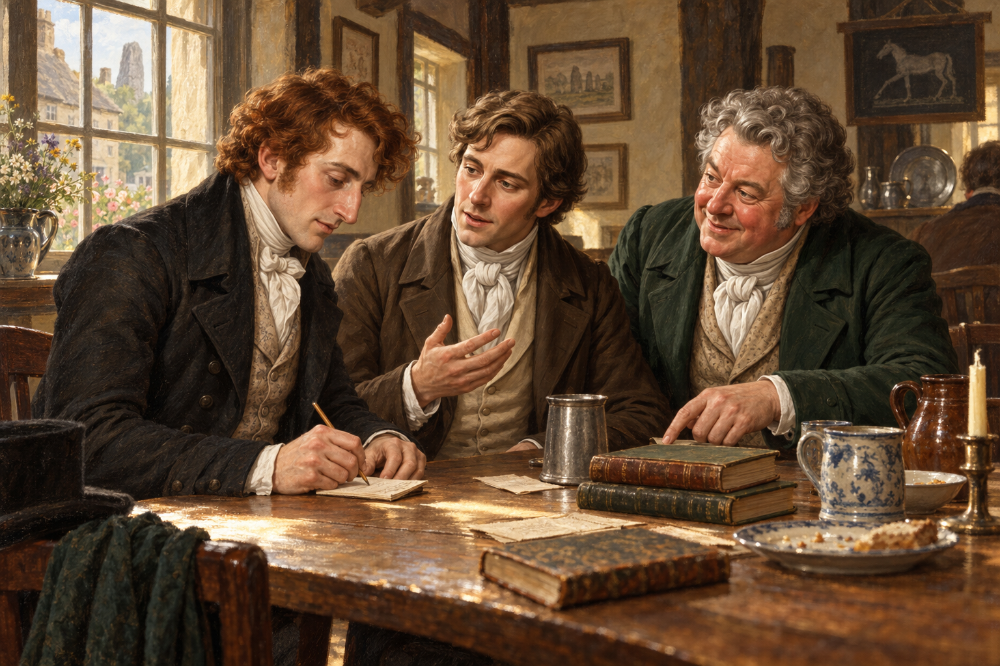

# 酒家餐桌上的書名

從影宅那場被彼此闖入的夢走出來後，斯特蘭奇、斯剛德斯與亨尼福特在埃夫伯里的喬治酒家共進晚餐。斯特蘭奇聽見自己還沒讀過的作者，忙著用記事簿、帳條，甚至手背記下名字。畫面停在他低頭寫字、斯剛德斯接著說、亨尼福特也湊近推薦的一刻。

斯剛德斯和亨尼福特曾因諾瑞爾的協議失去魔法師頭銜，在這桌邊卻仍保有閱讀、記憶與判斷。斯特蘭奇能施法，卻需要別人知道書在哪裡、哪些作者值得讀。三人交換的不是一場魔法表演，而是此前被制度隔開的知識。

我喜歡亨尼福特說起《鳥之語》時那份藏不住的熱切，也喜歡斯特蘭奇從先前的惱怒轉為真正聆聽。夏日傍晚的酒家讓這份希望暫時有了位置；至於亨尼福特隨後提出去見諾瑞爾的主意是否明智，仍留給下一章。畫面不顯示可讀的書名或帳條內容，也不替將來的師徒關係下結論。

