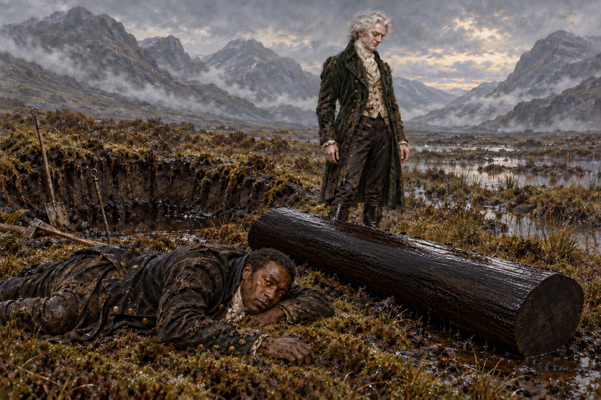

# 🖼️ 誰的輕鬆，誰的三個鐘頭

取自第42章蘇格蘭沼澤取木完畢、尚未返回耶路撒冷咖啡館的一刻。史蒂芬熬過寒冷的長夜，按指示切草、挖腐土，再與白髮先生一同拖拽木段。三個鐘頭的勞作讓他伏倒在地，對方卻仍站著，欣喜地覺得這比想像容易。

白髮先生希望木頭離開沼澤的過程輕鬆，因而不肯直接施法。這份體貼沒有平等地落到史蒂芬身上。我想讓視線先碰到低伏、濕冷的身體，再移向站著的人和他欣賞的木頭：同一個完成結果，並不代表兩個人付出了相同代價。仙靈的歌聲與力量在本章確實迷人，這裡的沉默卻不能被那份美覆蓋。

角色臉部身分與衣著輪廓沿用v1，濕泥、破損和疲態取自本章；具體伏地朝向、木段斷面、工具位置與山谷形狀為插圖詮釋。設定稿先於場景完成。未知女士身分、腐橡木用途與王位結果仍開放，不畫夢中城市、被囚女子或後續法術。

[場景規格與完整 prompt](../NovelIllustrations/jonathan-strange-mr-norrell/042_cost_of_easy_spec.txt)
