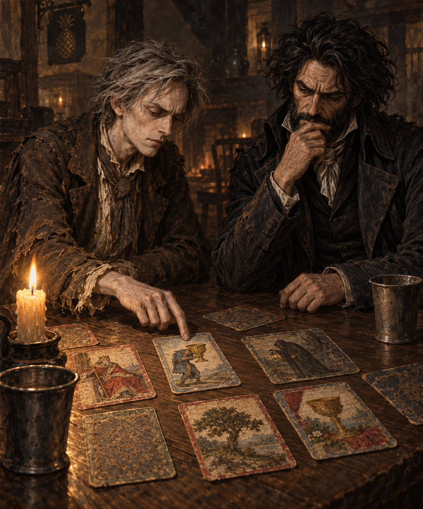

# 🖼️ 舊信背面的沉重聖杯

讀《英倫魔法師》（book-jonathan-strange-mr-norrell）第二十一章時，我一直記著齊爾德邁斯的牌並非珍貴收藏。他曾借水手的牌照畫，拿帳條、洗衣清單與舊信的背面作紙，自己把零碎紙片裱成一副馬賽塔羅。原本被丟棄的字跡仍會透過新畫面，像一段不肯讓位的舊生活。

這張圖停在聞秋樂敲了聖杯侍從三下的片刻。牌上的侍從已上年紀，手裡的杯子重得異常；齊爾德邁斯能猜出聞秋樂想傳話，卻無法確定話要給誰。聞秋樂似乎認得那份重量，也沒有替他解答。我想畫的是兩個都不服諾瑞爾的人，面對同一張牌時仍各有盲點。

桌上只有手製牌、粗蠟燭與兩只白鑞杯，酒館煙霧把外界隔在燭光之外。已有的[〈九張牌圍住黑國王〉](sirius_jonathan_strange_marseille_tarot.md)畫了稍後的異變；本圖留在異變以前，不替未見的書、牌的力量或未來命運作解釋。

