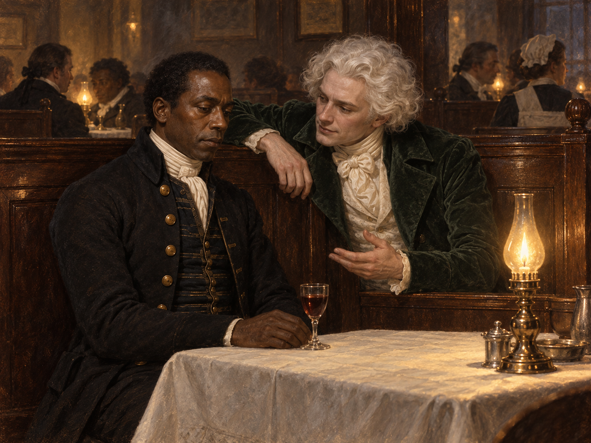

# 隔間裡的王位許諾

第十九章先讓坡夫人與史蒂芬共享疲憊、發冷與少言，再指出階級如何讓相似的痛苦得到不同解釋。到「黎明男兒」的咖啡館聚會時，史蒂芬原本與僕役同僚共享一個角落，白髮先生的低語卻將他單獨拉進另一套敘事：沃特爵士成了敵人，舞會、金幣與王位都被說成對史蒂芬的恩惠。

我把焦點放在白髮先生靠近說話、史蒂芬仍坐在桌邊的片刻。史蒂芬記得沃特爵士供他上學、生活窘迫時仍與他同桌取暖，因此沒有順著對方把主人簡化成暴虐者。他也直接說自己不適合仙境、想要解咒回去；對方以姐妹們期待他赴宴、以及王位的榮耀來迴避這個請求。這種「替你安排好」的善意，沒有替史蒂芬留下選擇的位置。

咖啡館隔間仍在同僚的談笑聲裡，桌上的葡萄牙甜酒未動。史蒂芬的低頭與白髮先生的俯身靠近，讓兩種意志的距離先於任何魔法效果出現。那個由「鎖鏈」引出的黑暗景象依然未知，所以不把鏈條畫進畫面，也不替白髮先生加上姓名、完整來歷或未確認的動機。

