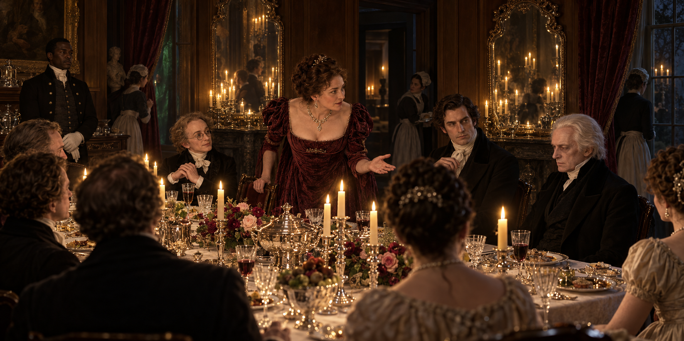

# 坡夫人把晚宴問回孤獨

第十五章的晚宴不是單純的上流社會裝飾，而是一台把人重新命名的機器。坡夫人復生後的活力很快被倫敦翻譯成「沃特爵士找對了妻子」的公共形象；她真正的敏捷、健康與政治判斷，則在那個形象裡被折疊起來。畫面讓她站在玫瑰、銀器、玻璃與燭光的中心，不是因為她只是宴會主人，而是因為她仍能把問題直接丟回諾瑞爾：如果英格蘭魔法需要復興，為什麼他找不到幫手？

諾瑞爾坐在名聲的光裡，卻比任何人都孤單；德羅萊特與拉塞爾斯把他的沉默轉成可流通的社交語言，史蒂芬・布萊克則在門邊維持一套實際有效、卻依靠階級與傳聞來理解的僕役秩序。這讓晚宴的華麗反射具有雙重性：鏡子把燭光放大，也把每個人的位置放大，卻沒有替任何一個人提供真正可靠的解釋。

三名僕人各自回報銀髮綠衣的人影、沒有來源的悲傷音樂與窗外不該存在的樹林。畫面只在鏡面、帷幕與窗邊留下彼此分離的含混感，不把它們合併成同一個鬼魂或已證實的魔法；真正被固定下來的，是史蒂芬急於恢復秩序的解釋，以及解釋仍然遮不住的裂縫。

