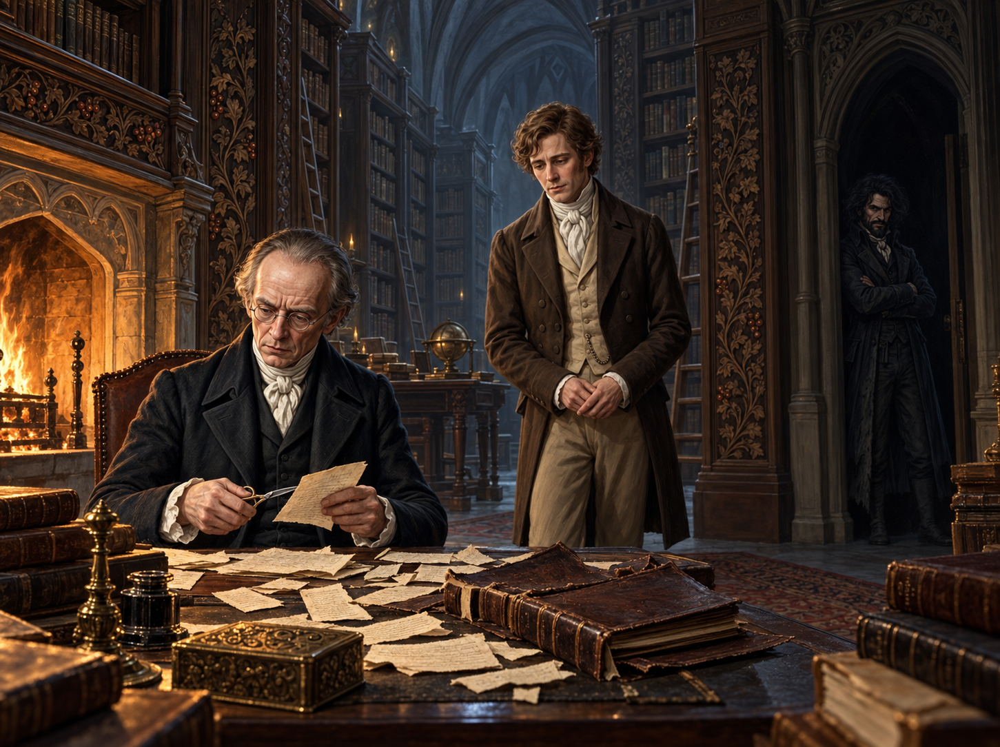

# 🖼️ 裁切魔法古籍的諾瑞爾

赫特福書房像被私人秩序封存的魔法入口：約克的紳士們只談論魔法、不再施法，而塞貢杜斯走進這座迷宮般的藏書室後，連自己最可靠的方向感也失效。龐大的哥特式書架與沒有來源的冷光，讓知識顯得既完整又拒人於千里之外。

我把心得的核心放在壁爐旁被拆散的古籍。諾瑞爾手裡的剪刀、桌上散落的缺頁與被剝下的書皮，說明他不只是保存傳統，也在替傳統決定哪些內容可以留下。塞貢杜斯在冷光裡察覺這件事，奇德曼則站在暗門邊守住界線；三人的距離把「保存」與「壟斷」之間的疑問具體化。

當諾瑞爾平靜地宣稱自己是合格的實用魔法師，畫面不需要再添加奇觀。真正的魔法是他對書本與房間的控制：火光照亮他的手，冷光照亮被裁掉的空白，而讀者只能在兩種光之間判斷，他究竟是失落魔法的守護者，還是第一道門。

