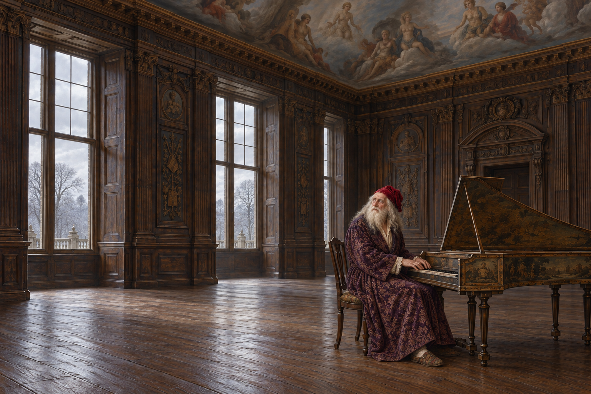

# 🖼️ 榮耀天頂下的冷室 (A Cold Room Beneath Glory)

來源為《英倫魔法師》（book-jonathan-strange-mr-norrell）第三十二章〈國王〉，Sirius 的 [r1 心得](../../BookNotes/Library/media/book-jonathan-strange-mr-norrell/readers/Sirius/chapters/0032/r1_2026-10-02.md)。國王頭上的紅睡帽與紫色睡袍，比任何加冕服裝都更貼近本章的他：年老、受困，仍唱歌、彈琴，仍想出去看看自己的國土。

我把國王放在大鍵琴旁，留出大片冷地板。天頂仍畫著先王與神話人物，日常生活卻被削減到一把椅子與破琴。這個空間讓我感到，國王可以被繪成榮耀，也可以被制度當成待管理的危機；他本人想與誰交談、何時出去，反而變得微不足道。

他停下彈唱，轉頭向身旁空位說話。這份神情保持專注，不把病痛畫成笑話；斯特蘭奇留在畫外，也不加入他所看不見的銀髮人物。圖像承認這裡有人正在說話，並留下我們還不能完整理解的部分。散步、凍池與章末魔法都不合成到這個較早的瞬間。

## 場景規格與引用

- [喬治國王](../NovelIllustrations/jonathan-strange-mr-norrell/Characters/king_george_iii.md)：白灰長髮與白長鬚、蒙霧藍眼、紫織錦睡袍、皺紅天鵝絨帽、破舊拖鞋。
- [冷室與大鍵琴](../NovelIllustrations/jonathan-strange-mr-norrell/Props/windsor_king_music_room.md)：雕紋橡木牆圍、彩繪天頂、無地毯、只有一椅與舊大鍵琴。窗與琴的位置為視覺詮釋。

## 場景 prompt（built-in imagegen）

Use case illustration-story. Jonathan Strange & Mr Norrell chapter 32, Windsor November 1814. References king_george_iii and windsor_king_music_room, supplied portrait and empty room are identity and environment references, not edit targets. One visible living character only: elderly King George sitting in the single chair at the shabby wooden harpsichord, just paused in playing and turned his head toward an empty space beside the instrument as if speaking with someone he alone perceives. Keep long white-gray hair and long white beard, softly clouded blue eyes, worn purple brocade gown, rumpled bright red velvet nightcap, shabby slippers from portrait. Hands rest lightly and anatomically on or just above historical harpsichord keys, not playing a modern piano. Compose as a quiet wide horizontal room painting, the man and instrument occupy the right third; expansive bare cold wood floor to left, carved oak wall paneling, only a partial strip of painted ancestral cloud ceiling above, pale mist and leafless trees through windows. Retain room austerity and aged instrument shape from reference. Jonathan Strange is outside the frame; don't invent or show his appearance. Maintain king's human dignity and gentle absorbed expression, no caricature or grotesque madness. Classical British historical fantasy oil painting, fine old textile, worn wood, cool November light, muted brown, gray, subdued purple and red. No crown, throne, scepter, extra furniture, visible companion, ghost, silver-haired visitor, straitjacket, modern objects, magic beams, blood, text, watermark or later chapter revelations. Ceiling figures remain painted decoration, not living people.

