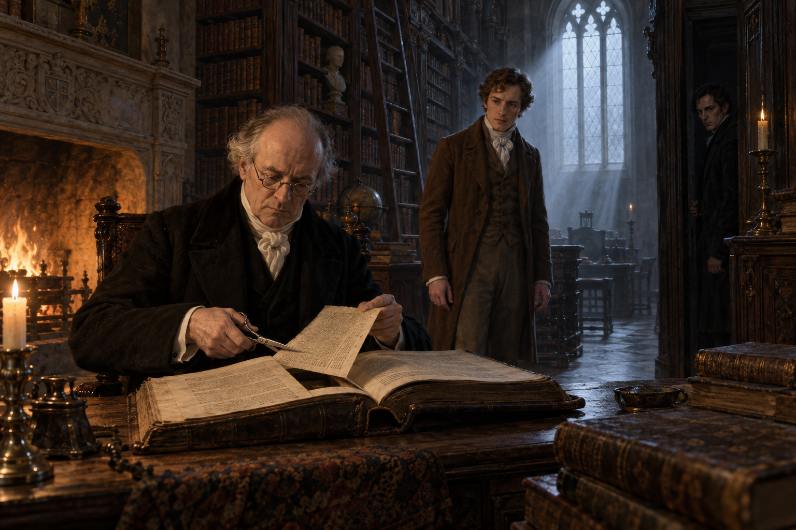

# 🖼️ 被裁下的知識之門

第一章把「魔法是否消失」放在一座幾乎不讓人抵達的書房裡。塞貢杜斯在哥特拱頂與無來源冷光之間迷失方向，而諾瑞爾坐在壁爐旁，把一本古籍拆成自己允許留下的形狀；畫面裡真正被看守的，不只是書，也是一條通往傳統的入口。

我讓剪刀停在頁面中央，讓火光照亮諾瑞爾的手，冷光照亮被移走後的空白。塞貢杜斯是看見缺頁的人，奇德曼則站在門邊成為另一重界線：保存與壟斷並沒有清楚的分隔，當整理者掌握了刪除權，知識就同時成為資產與門禁。

這一刻不需要奇觀來證明魔法存在。諾瑞爾對書本、房間與觀看位置的控制，已經比任何咒光更像一種實用魔法；讀者只能在兩種光之間判斷，他究竟是失落傳統的守護者，還是第一道門。

