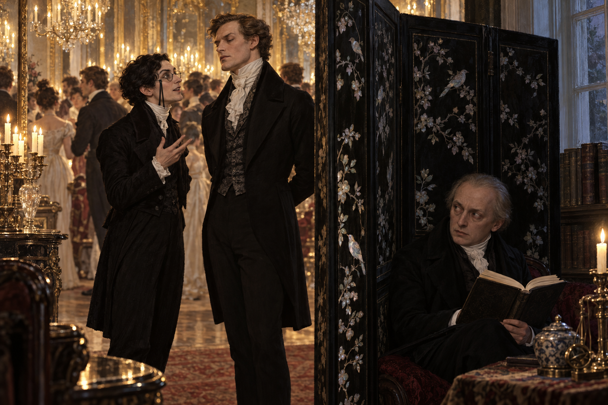

# 🖼️ 屏風後的魔法師與被說出的名字

第四章讓魔法從約克大教堂的公共奇蹟，轉成倫敦社會可以消費、轉述、誤讀的名聲。諾瑞爾想以自己的方式建立魔法的公共位置，卻被報紙、晚宴與旁人的期待推進一個他無法控制的形象裡。

我把場景放在高大的黑檀木屏風後：諾瑞爾終於找到一個能讀書的角落，卻在書櫃旁聽見德羅萊特與拉塞爾斯談論他的財產、外貌與傳聞。德羅萊特把齊爾德邁斯認成他，先替倫敦想像出一個神秘、狂野、浪漫的魔法師；真正的諾瑞爾出聲時，傳聞與本人已經產生落差。

畫面不把晚宴的喧鬧畫成單純背景：屏風外是鏡子、燭光與擁擠的人群，屏風內是冷靜的書頁與被迫聽見的名字。這不是諾瑞爾成功掌控形象的瞬間，而是他開始明白，魔法一旦進入公共敘事，就不再只由施法者決定它的形狀。

拉塞爾斯的確切年齡、髮色與服裝細節仍未由已讀章節確認；本圖只保留他已確認的高大英俊與冷酷傲慢。德羅萊特與拉塞爾斯的更大動機、晚宴之後的關係與任何後續魔法事件，皆不在本圖中提前揭示。

