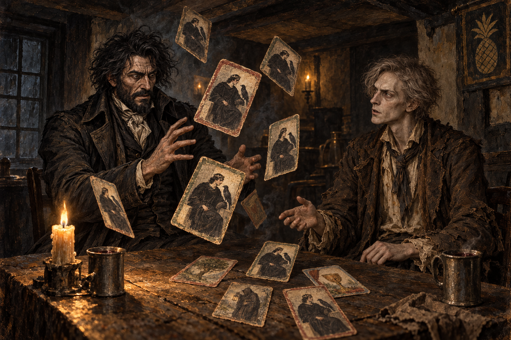

# 九張牌圍住黑國王

「鳳梨」酒館裡，齊爾德邁斯原本把占牌當成拆穿聞秋樂的遊戲。他用九張牌推測聞秋樂準備離開倫敦，也在牌義不再明確時收住了先前的譏嘲。聞秋樂接過牌，替他翻牌；當皇帝在整副牌裡一再出現，牌上的君王逐漸變成年輕的黑髮男子，角落的鷹也變成渡鴉，齊爾德邁斯才真正被眼前的變化攫住。

我把畫面停在紙牌圍住齊爾德邁斯的時刻。這副牌是他借來照畫、用帳條與信箋背面拼成的手工品；它既是他用來觀察別人的工具，也是聞秋樂指出他無法迴避之事的媒介。齊爾德邁斯平日熟悉替主人蒐集情報、盤問與設局，這次他卻面對一個自己既不相信、也無法立刻解釋的答案。

聞秋樂沒有替牌面變化說明機制，只要齊爾德邁斯把所見帶回漢諾威廣場。我不把牌面延伸成已知預言規則，也不畫第二十一章之後的反應。桌上只留手工牌、蠟燭與兩只白鑞杯，酒館的煙霧將這段對話困在燭光能到的範圍內。

