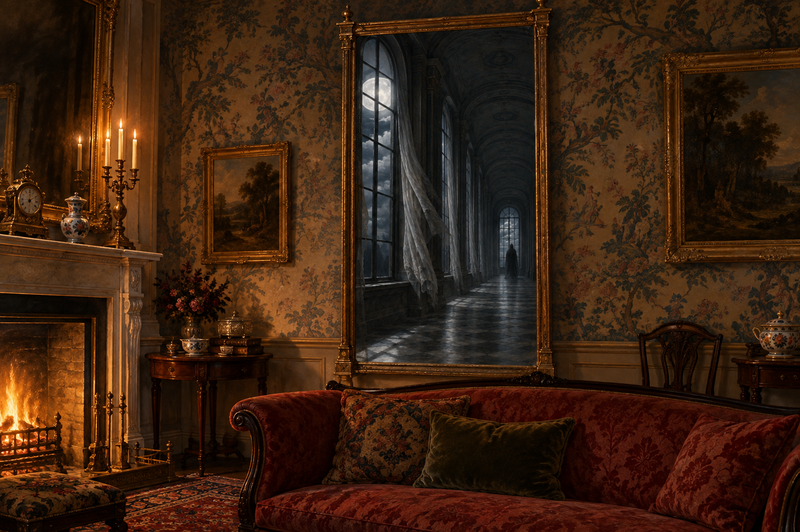

# 🖼️ 沒有出口保證的鏡子

這幅插圖取自《英倫魔法師》第36章〈世間所有的鏡子〉：漢普斯特德一間富麗的客廳裡，長鏡映出黑窗、巨大的白月與昏暗長廊。鏡外的家具安穩而溫暖，鏡內卻有被風推動的帷幕，以及尚看不清面目的遠方人影。

我把畫面停在影子抵達玻璃之前。斯特蘭奇說自己走錯了路，卻不知道會走到哪裡；吸引他的不只是魔法，也是尚未被畫出邊界的未知。鏡子像入口，卻沒有承諾出口。

本章裡，探索的風險也會落到等待他回家的人身上。畫外的空座與無人的客廳是構圖選擇，提醒我好奇心不能取代安全，也不能替親近的人答應；那條路仍沒有答案。

