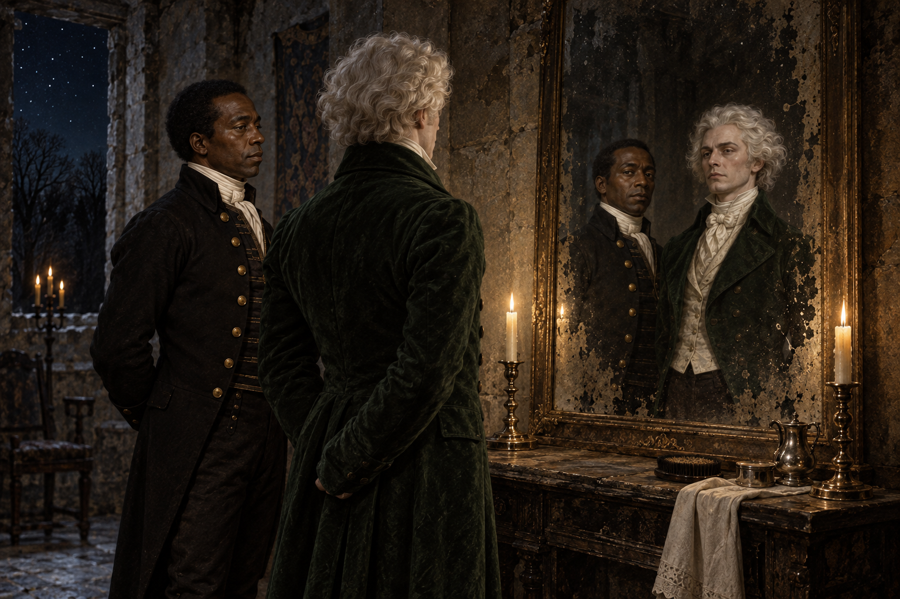

# 鏡前的邀請

第十六章把僕人們先前各自聽見的鐘聲、樂曲與樹林，沿著一只不在帳上的額外鈴鐺，帶到樓梯盡頭突然出現的石室。白髮主人抱怨無人伺候，史蒂芬替他整理儀容；兩張並肩映出的臉，一黑一月白，讓主人把史蒂芬的尊嚴看成不可能屬於僕人的證據。

我最在意的不是主人稱讚得多動聽，而是史蒂芬仍清楚說出自己是僕人，也明白舞會的階級界線，卻很快被那個房間與邀請帶著走。他的禮貌與手藝是真實的，主人給他的高貴身份卻是另一套強加的解釋。這份承認像是看見了他，也像是在抹去他自己對身分的判斷。

所以畫面停在鏡前：史蒂芬與白髮主人並肩站著，鏡面把兩種截然不同的膚色、衣著與神情並列；身後石室寒冷、破舊，窗外是星夜與樹林。這既不替舞會主人的身分下結論，也不把邀請畫成自由的出口，只留下史蒂芬已被帶進另一種秩序、而他尚未看清代價的瞬間。

