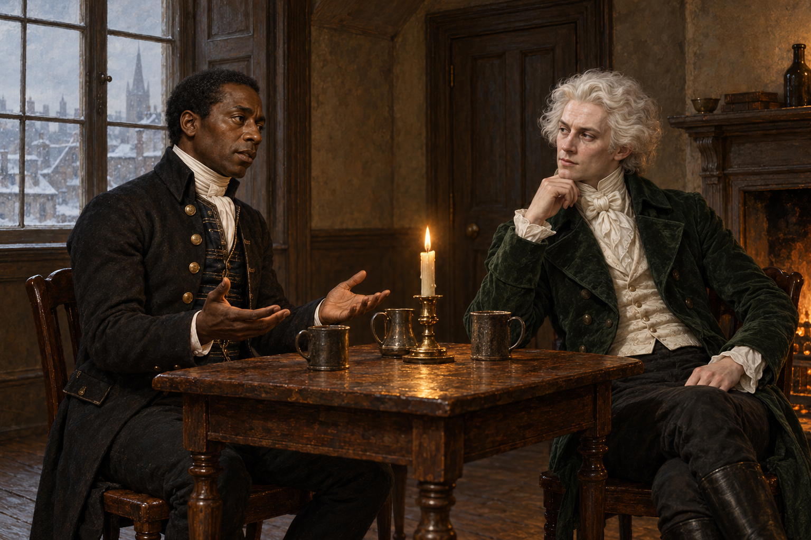

# 🖼️ 王位許諾前的雙手 (Hands Before the Promise)

來源為《英倫魔法師》（book-jonathan-strange-mr-norrell）第三十章〈羅伯特·范岱穆之書〉，Sirius 的 [r1 閱讀心得](../../BookNotes/Library/media/book-jonathan-strange-mr-norrell/readers/Sirius/chapters/0030/r1_2026-10-02.md)。白髮先生許諾英格蘭的王位時，史蒂芬攤開雙手，想到自己的黑皮膚，試圖說明這個安排為何與他的生活相隔那麼遠。

我把畫面留在兩雙手之間：史蒂芬的掌心向上，帶著克制而具體的追問；白髮先生的姿態仍自信而熱切。這不是史蒂芬接受加冕的一刻，而是他正在說明自己。他對母親與名字的渴望，也不能直接被換算成對報復與王位的同意。

咖啡館雅間保持平常的木桌、椅子與冬光。衣料與膚色的對比承接人物設定；不加鎖鏈、王冠、預言幻象或母親肖像。那些未被確認的未來留在畫面之外，讓眼前這個人有被看見的份量。

## 場景規格與引用

- [史蒂芬](../NovelIllustrations/jonathan-strange-mr-norrell/Characters/stephen_black.md)：黑人男性、短黑髮、正式深色管家服、白領巾，表情疲憊而清醒。
- [白髮先生](../NovelIllustrations/jonathan-strange-mr-norrell/Characters/white_haired_gentleman.md)：蒼白膚色、蓬鬆銀白髮、深綠考究外套、白領巾，保留自信與禮貌。
- [雅間](../NovelIllustrations/jonathan-strange-mr-norrell/Props/wootton_upper_room.md)：小型頂樓室內；桌椅和窗光是詮釋，不鎖成原文細節。

## 場景 prompt（built-in imagegen）

Use case: illustration-story. Chapter 30, Jonathan Strange & Mr Norrell. Narrative moment: Stephen Black opens both hands while explaining why the gentleman's promised English kingship does not fit his lived situation. References: stephen_black, white_haired_gentleman, wootton_upper_room; the three supplied images are identity and environment references, not edit targets. Exactly two seated men in a small London coffee-house upper private room, winter 1812. Stephen at left: dark skin, short black hair, dark formal butler coat, brass buttons, white cravat; restrained weary expression, both hands open palms upward before him, carefully speaking. Gentleman at right: very pale skin, abundant silver-white hair, dark green tailored coat and white cravat, alert confident self-assurance, looking at Stephen. Waist-up three-quarter composition, clear natural hands, small wooden table, subdued winter window light, modest candle warmth. Classical British historical fantasy oil painting, tactile dark cloth and aged wood, quiet tension, muted green, brown, cream and silver. No text, no watermark, no crown, no orb, no scepter, no chains, no visions, no additional people, no later plot revelations. Do not depict a coronation or confirm a prophecy.

