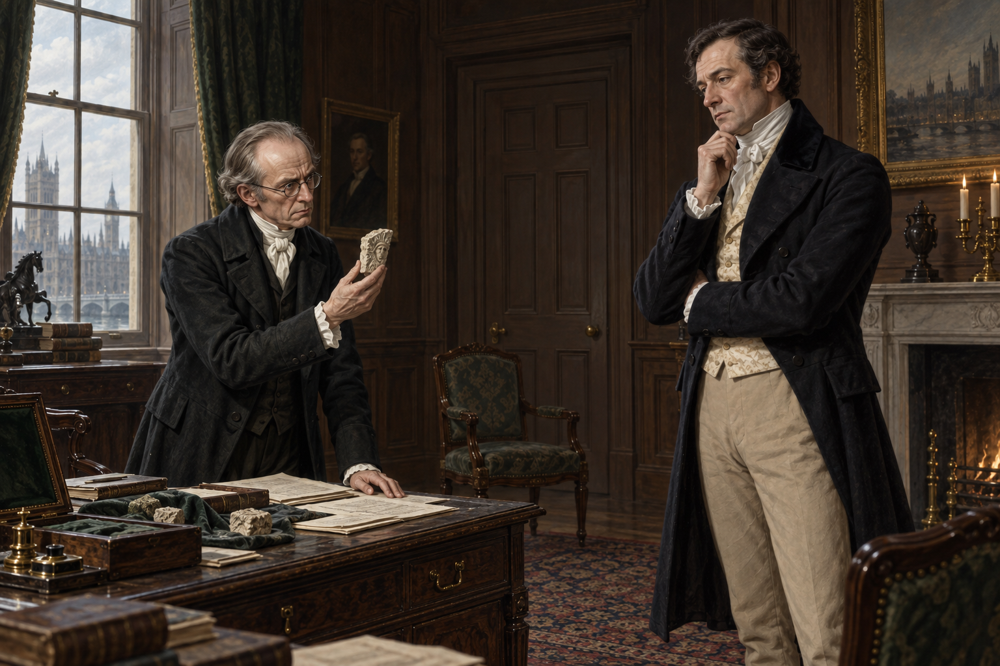

# 🖼️ 被體面分類的公共魔法

第六章把諾瑞爾想像中的「國家需要魔法」，放進一間不肯承認病人的客廳裡檢驗。沃特・坡並不先否認奇蹟，而是先問魔法是否體面、是否正派、是否會讓政府成為笑柄；這不是對能力的測試，而是對社會分類的測試。

畫面讓諾瑞爾把石頭證詞、研究紙頁與戰爭用途攤在桌面上，手中的石片帶著約克大教堂的歷史重量，卻沒有被畫成發光的奇觀。沃特・坡站在另一側，姿態冷靜，目光衡量的是公共承認的代價。兩人之間的空桌面不是空白，而是魔法必須跨過的制度距離。

背景的關閉房門與空椅只提示屋內有人被忽略，不畫病人、病床、診斷或任何復生結果。母親的警惕、女兒的需求、德羅萊特的報復與黑王的線索，都保留在本章已讀範圍內，不用沉默替未讀內容收尾。

