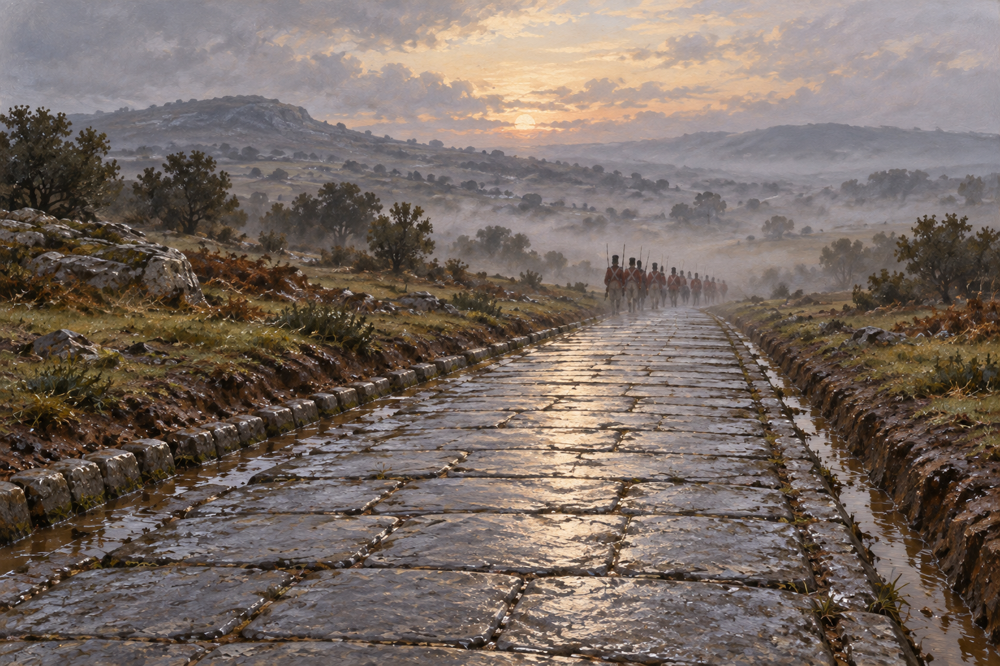

# 🖼️ 腳下先有一條路

斯特蘭奇帶著魔法來到葡萄牙，卻發現部隊不知道可以請他做什麼。布里斯科勸他先和官兵住在一起；後來乃德在一連串金子、鑽石的玩笑中要了一雙新靴子，那個答案把施法者的目光拉回行軍的腳底。道路的材質、雨水如何排走、大炮能否通過，都成了真正值得討論的問題。

我把濕石板與兩側溝渠放到畫面前方，讓遠處匿名行軍者的輪廓縮在晨霧裡。這張圖不辨認乃德或威靈頓，也不替本章補一場人物會面；清晨的視點是對「道路已就位、部隊即將通行」的畫面詮釋。魔法沒有可見的光束，作用藏在一塊平整、可落腳的石頭上。

這條路仍有我不想抹掉的限制：它依行軍回報定時消失，第11團便曾趕不上。畫面停在通行的希望，心得則保留對排程的疑問。有人終於得到幫助，不等於每個需要幫助的人都已被照顧到。

## 場景規格與生成提示

- 章節／時刻：第29章，臨時羅馬式道路在清晨已完成；依造路與行軍資訊作匿名群像詮釋。
- references：`temporary_roman_road`。設定稿已先打開核對濕灰石板、密合平面、左右露天排水溝。
- 構圖：低視點橫幅，石板路為前景主體，透視引向晨霧中的小型行軍隊列；官兵遠小於道路，不提供可辨識面容。
- 光線與情緒：雨後淡色晨光，灰銀濕石、褐土、遠方低調紅衣；平靜而帶未解的不確定。
- 必須保留：平整密合石板、兩側排水溝、十九世紀初服飾輪廓、鄉野濕地。
- 不可出現：具名新人物、現代道路設備、新橋梁、戰鬥、道路消失特效、符文、光束、可讀文字、水印、第30章以後內容。
- 工具：內建 `imagegen`；以本作道路設定稿作材質與結構參考，另生新構圖。英文 prompt 的主要指令是：low-view dawn illustration, wet closely fitted grey slabs, drainage ditches on both sides, a small distant anonymous British infantry column moving away in mist, traditional historical fantasy oil texture, no named characters and no visible magic.
