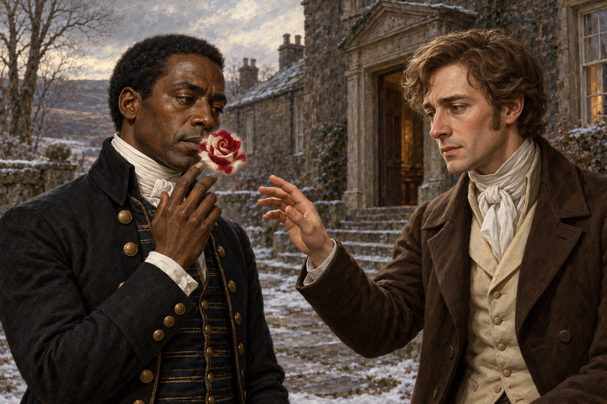

# 🖼️ 看見玫瑰，尚未接住求救

來源為《英倫魔法師》（Jonathan Strange & Mr Norrell，book-jonathan-strange-mr-norrell）第47章。望穿堂告別的早晨，斯剛德斯問起史蒂芬和坡夫人嘴上的紅白玫瑰；史蒂芬伸手摸嘴，卻什麼都摸不到。他曾一瞬間想把受困的經過告訴這位能看見法術的人，隨後仍帶著不信任離開。

我想把那個尚未相接的瞬間留下。兩隻手都向嘴旁靠近，彼此卻沒有碰觸；一人看見束縛，一人還不能相信這會帶來出口。看見不是解咒的證明，也不要求受困者立刻把自己的故事交出去。斯剛德斯準備舒適房間、願按客人的意願安排散步，都是實際的照料，但仍不足以保證他能聽懂夜間舞會或解除法術。

這章後來的援手與拒援，也照回了玫瑰。郵差幫史蒂芬處理翡冷翠的死亡，仍用偏見替他的膚色決定位置；白髮先生聽懂狼的求救，卻不救它。能看見或聽懂，與肯讓對方的需要改變自己的下一步，是不同的動作。這張圖只讓信任的可能出現，沒有替它寫好結局。

場景引用既有兩名角色與望穿堂石屋設定，新增 `silencing_red_white_rose`。取景在翌晨尚未上馬時，以門階附近的前庭作畫面詮釋，並非正文精確站位；雪量、冬光、手勢與花形亦屬詮釋。玫瑰位於嘴邊、無莖葉，採斯剛德斯的感知，不表示史蒂芬看得到它。白馬、坡夫人與其他人均在畫外，沒有王冠、狼獵、事故或第48章以後資訊。v1已視檢：兩名人物、手未接觸、既有服装與面貌保留，無文字或水印。

生成：內建 imagegen，使用四張已視檢設定圖。場景 prompt（完整）：

Use case: illustration-story. Asset: final gallery reading reflection, Jonathan Strange & Mr Norrell chapter47, January1816. Narrative moment: morning farewell at Starecross Hall, before Stephen mounts his horse. Reference1 Stephen Black: preserve his dignified dark-skinned face, short textured black hair, dark Regency butler coat with brass buttons and white cravat. Reference2 John Segundus: preserve his slender build, wavy brown hair, sincere face, modest brown coat, cream waistcoat and white cravat; slightly older and weathered than the young reference. Reference3 house: use dark low stone manor and worn paving as architectural vocabulary, a cropped courtyard near the stables, light snow and frost in cold morning daylight. Reference4 rose: use ONE small mixed red and ivory-white bloom visibly hovering directly over Stephen's lips, as a subjective magical perception available to Segundus, not a held or physical flower. Compose a restrained intimate waist-up TWO-person oil painting: Stephen on left, guarded and uncertain, raising fingertips just beside his own lips without touching the rose; Segundus on right gently extends one hand toward Stephen's face but STOPS several inches away. Their hands and faces must be clearly separate and anatomically plausible. The rose is small enough to sit over mouth only, leaving Stephen's nose, eyes and facial identity unobscured. Stephen's hand feels nothing. Neither man smiles; possibility of trust has not become trust. Faces visible three-quarter view. Horse is entirely OUTSIDE crop; no other characters. Established English literary historical fantasy oil painting, fine painterly brushwork, muted grey frost and warm brown coats, modest red-white flower contrast, horizontal composition. No book, pen, wand, touching faces, kissing, flower stems, leaves, thorns, chains, stitches, blood, halo, glowing runes, crowns, prophecy scene, white-haired fairy, wolves, dead horse, readable text, watermark. Depict perception, not removal or healing. References: stephen_black, john_segundus, starecross_hall_steps, silencing_red_white_rose.

