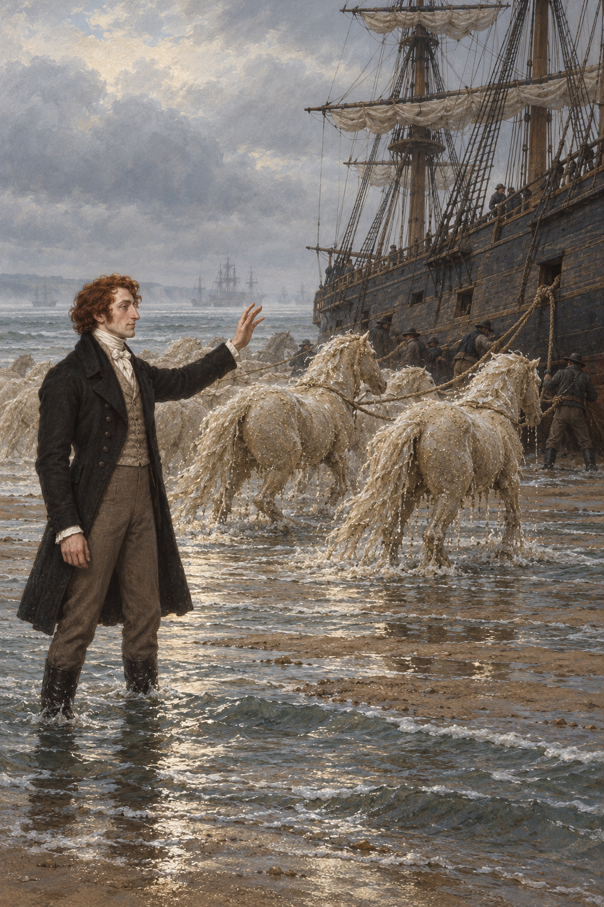

# 🖼️ 銀馬越過淺灘

船陷在 Horse Sand，斯特蘭奇本想用風把它推離沙洲；水手吉爾比提醒他，風若從錯誤方向吹來，只會使船陷得更深。斯特蘭奇聽進這份海上經驗，換了一種方法：讓沙與海水成為一群銀白的馬，繫上拖繩去拉船。

我把畫面放在救援剛開始時。斯特蘭奇站在淺水邊，身後是冷霧中的 Spithead；幾匹水痕未乾的沙馬穿過浪間，船員在船身旁接好繩索。馬的外形像真馬，材質卻仍是鬆動的濕沙與水，像一個正在移動、也可能隨時改變的魔法解法。

這一章沒有把魔法寫成取代知識的捷徑。風向的判斷來自水手，施法者則把這份提醒轉成另一個辦法。救援確實發生，但它也改動了原有環境；我想留下的正是這份力量與後果並存的重量。

