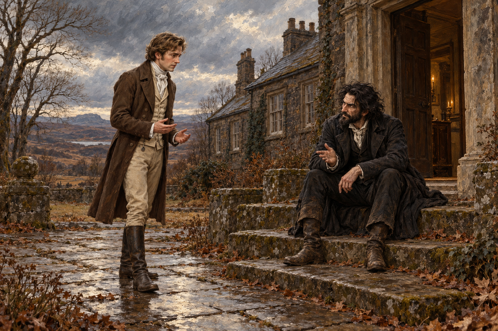

# 🖼️ 開著的門，停住的學校

取自第41章，1815年12月中旬望穿堂門口。斯剛德斯已找到願意出資的萊諾克斯夫人，校舍也開始修繕；齊爾德邁斯卻坐在台階上，告訴他諾瑞爾希望他停辦魔法師學校。這是兩人第一次對話，尚未到騎馬離開的片刻。

我想保留那扇開著的門。障礙並不全在石牆裡：斯剛德斯沒有簽九年前的協議，仍要承受掌權者的人脈壓力。坐著的人不用拔劍或施法，就能讓站著的人覺得希望將被奪走。畫面取安靜而非戲劇性的威脅，不把他當成真正的噩運精靈。

兩人沿用已有臉部身分與服裝輪廓，斯剛德斯稍成熟，外套磨舊；齊爾德邁斯保持黑色亂髮、旅行外套與泥靴。具體姿勢、門框、冬光与前庭鋪石是構圖詮釋。學校、求援信與缺指女子幻象的後續都未確定；不畫諾瑞爾本人、学生、馬匹或超自然效果。

[場景規格與完整 prompt](../NovelIllustrations/jonathan-strange-mr-norrell/041_school_threshold_spec.txt)
