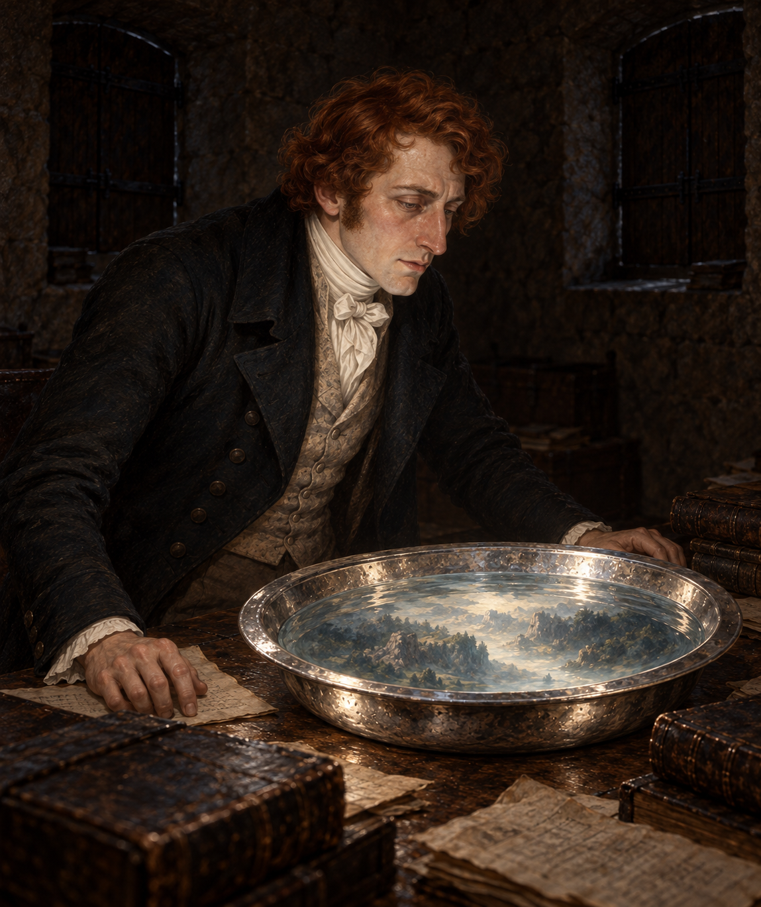

# 🖼️ 照見，卻不知何處 (Sight Without a Place)

來源為《英倫魔法師》（book-jonathan-strange-mr-norrell）第三十一章〈十七具那不勒斯人的屍首〉，Sirius 的 [r1 心得](../../BookNotes/Library/media/book-jonathan-strange-mr-norrell/readers/Sirius/chapters/0031/r1_2026-10-02.md)。這次把畫面留在阿爾瓦兵器塔內，喚醒死者之前：銀盆能看見藏炮的岩石與林木，懷特上尉能翻譯逃兵的談話，可兩人仍找不到所在地。

斯特蘭奇俯身看水，光照亮他的臉與散落的舊書。水面並非空白，也沒有失靈；它只是無法回答軍令最急著要問的問題。這個尚未被尊重的限制，後來被推向施法者不能善後的復生。我想讓觀看的疲憊先留在圖上，不用後來的慘景替他預先解釋自己的臉。

畫面採緊密的三分之四近景，只讓斯特蘭奇可辨識出場。懷特上尉在鏡頭之外；盆中林木與淡白石形模糊，不具象逃兵的外貌或人數。沒有本章末尾的眉上傷疤、白髮與歸家服裝，也不添加屍體、天使、流血或法術符文。

## 場景規格與引用

- [喬納森・斯特蘭奇](../NovelIllustrations/jonathan-strange-mr-norrell/Characters/jonathan_strange.md)：沿用 v1 紅棕髮、長鼻與深色外套；1812年監看時的疲憊是姿態詮釋，不套用1814年返家的新特徵。
- [阿爾瓦兵器塔的幻影室](../NovelIllustrations/jonathan-strange-mr-norrell/Props/alba_tower_scrying_room.md)：緊閉窗板、散落舊書和紙片、中央桌上的寬沿淺銀盆，唯一光源來自盆中水面。

## 場景 prompt（built-in imagegen）

Use case: illustration-story. Jonathan Strange & Mr Norrell chapter 31, July 1812, before the necromancy episode. References: jonathan_strange and alba_tower_scrying_room. Two supplied images are character identity and room references, not edit targets. Tight three-quarter medium close-up of exactly one visible man, Jonathan Strange leaning toward a circular wide-rim shallow silver basin on a wooden table in the Alba arms tower. Preserve his auburn-red curls, long nose, lean familiar face, dark Regency coat, light waistcoat and white neckcloth. His expression is tired concentration and restrained frustration, his hands rest naturally on the table near scattered worn books and unreadable notes. Water shows faint pale rock shapes and dark olive/pine forms, enough to suggest a scene but no identifiable landmark, miniature person or readable map. Closed wooden shutters; water is the ONLY light source, casting subdued silver illumination upward onto his face, sleeves and books. Rough stone wall recedes into dark. Captain White remains outside this close crop; do not invent his appearance. Classical British historical fantasy oil painting, fine cloth texture, old paper and silver, muted charcoal, brown and gray-green. No candle, daylight, readable text, watermark, glowing runes, magical beams, blood, corpses, angels, ships, crown, scar above eyebrow or later gray-haired homecoming appearance.

