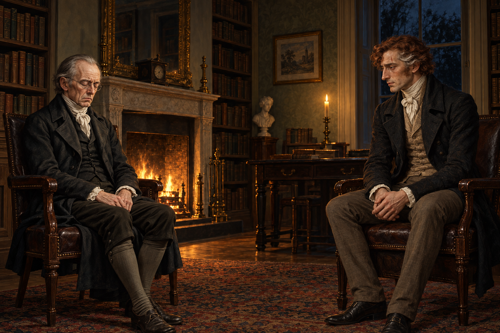

# 🖼️ 無法挽留的沉默

取自《英倫魔法師》第39章〈兩位魔法師〉，時間是1815年2月。斯特蘭奇拒絕重新合作，諾瑞爾閉上雙眼，僕人尚未端茶進來。外面的傳聞想把兩人變成互相威脅的敵手，我選的卻是沒有雷聲、沒有施法、只有兩個人仍坐在一起的瞬間。

諾瑞爾願意給出藏書室、平等地位與工作機會，甚至允許批評自己的文章繼續存在。他的害怕和孤獨讓我難以把這次挽留看得輕巧；但他仍希望斯特蘭奇把行動與發表延後，等到足夠確定。畫面裡兩把椅子之間的空隙，是我對這道分歧的詮釋：能共享資源的人，仍可能無法把自己的判斷交給另一個人保管。

斯特蘭奇的神情保持克制，沒有勝利姿態；他隔天就會後悔失去隨時討論魔法的對象。諾瑞爾沿用既有人物身分，病容與疲態依本章當次描述加重，不當作永久年齡設定。兩把椅子的位置、手勢及光線是構圖詮釋；書房保留暗木書架、爐火與黑窗，不畫藏書室鑰匙、茶盤、拉塞爾斯或未讀事件。

[場景規格、視檢與完整 prompt](../NovelIllustrations/jonathan-strange-mr-norrell/039_silence_after_refusal_spec.txt)
