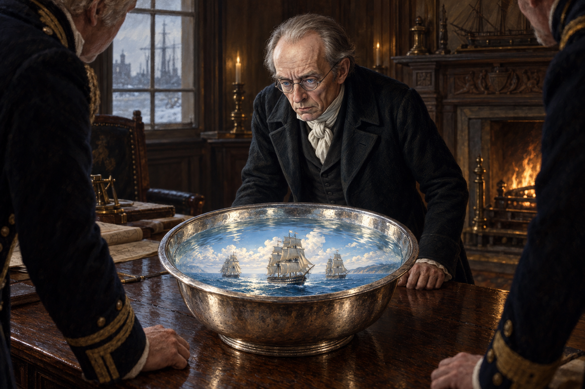

# 🖼️ 銀盆把遠方照進冬日房間

第十二章的銀盆不是把遠方變成一份完整報告。它只在海軍部冬日昏暗的會議室裡，短暫映出藍海、白雲與三艘破浪的軍艦；在場的人可以辨認船名與看見甲板上的小人，卻仍必須接受諾瑞爾對「幻化影像不準確」的界線。

畫面選在共同觀看的瞬間：諾瑞爾以既有的黑色紳士服俯身看向銀盆，銀盆內的地中海強光照亮他的臉與周圍匿名官員的手臂、袖口。魔法的明亮只存在於水面內，沒有把房間變成奇觀；它讓遠方出現，卻不交出完整位置，也不把本章之外的戰果提前畫出來。

本圖只鎖定第十二章已讀內容。人物不新增可辨識的海軍部官員，船隻只作為銀盆中的三艘幻影，不加入文字、旗幟標籤、後續軍事行動或未讀人物發展。

