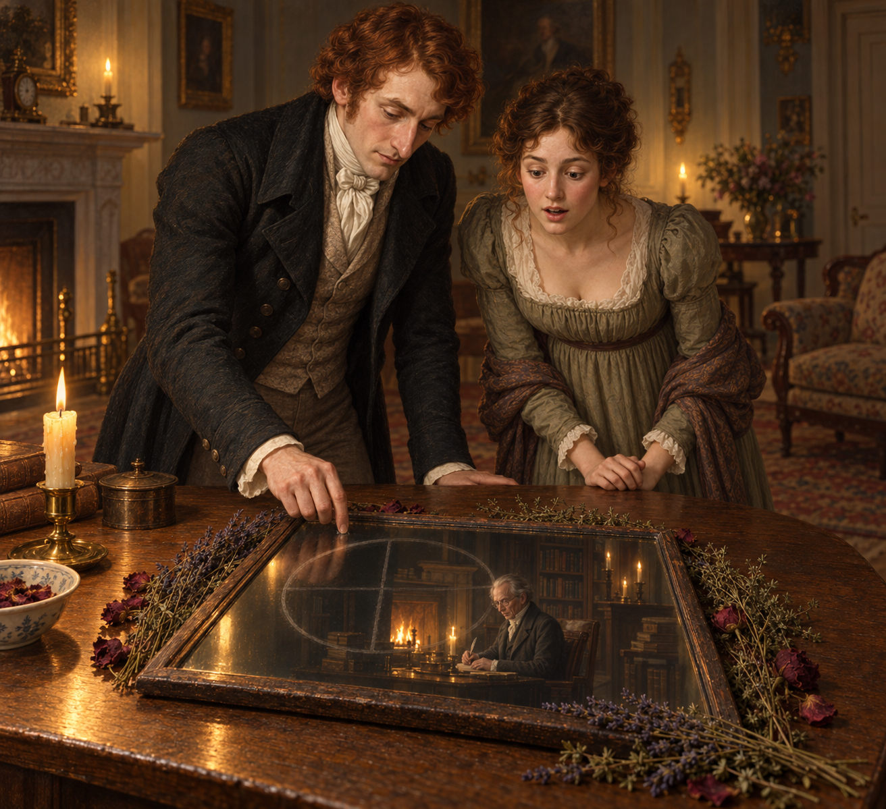

# 鏡中書房的意外相逢

喬納森原本只想讓阿拉貝拉看見一點新鮮把戲。他照著聞秋樂賣給他的咒語，把牆上的鏡子放平，讓乾燥的薰衣草、玫瑰與百里香圍住鏡面，再以手指畫出分成四份的圓。這個帶著幾分炫耀意味的嘗試，卻真的打開了一扇視線能通過、聲音不能通過的窗。

鏡中出現的不是模糊幻象，而是諾瑞爾正在使用的書房：書、火光、桌前的人。喬納森還不知道眼前這名陌生魔法師是誰，便先以輕鬆的玩笑掩住驚訝。阿拉貝拉也俯身看著鏡子；兩人共享這次成功，卻各自只能猜測它意味著什麼。

我喜歡這一刻的尺度：魔法沒有伴隨雷霆或莊嚴宣告，而是從一個有點隨意的社交心思開始，最後把兩個相距甚遠的人放進同一面鏡子。畫面保留客廳的暖光和諾瑞爾書房較深的色調，讓這次相逢既像一場意外，也像故事悄悄換了方向。此處只停在看見，不替兩人補上尚未發生的交談或關係。

