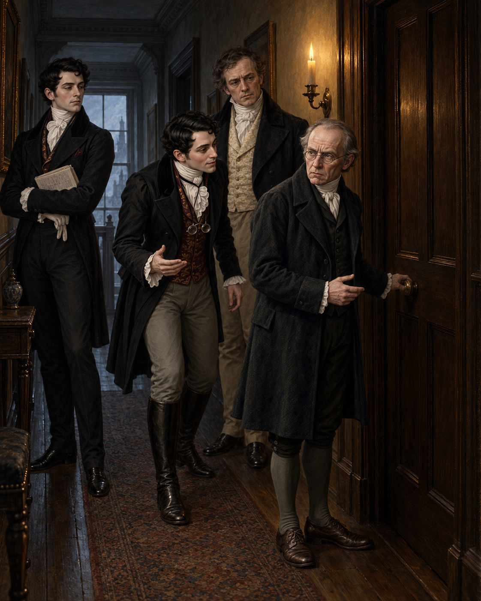

# 🖼️ 三樓房門前的第二次機會

第七章把「讓死者復生」從危險的魔法問題，推成一場被旁觀者爭搶命名權的公共事件。溫特唐小姐的病在上一章已被整個客廳共同否認；她死後，這份否認立刻轉成「只差一天就能保住一千鎊」的計算。德羅萊特把死亡翻譯成沃特・坡的財務損失、諾瑞爾的成名機會，以及魔法師階級可能獲得的國家地位，畫面裡因此沒有人能只面對一扇門。

我把場景停在三樓房門前：諾瑞爾伸手靠近門把，沃特・坡在燭影深處蒼白地等待，德羅萊特急著把危險變成可供傳播的壯舉，拉塞爾斯則抱著報紙站在旁邊，像一個不肯替別人承擔判斷的人。門沒有打開，房內也沒有被畫成可觀看的病床；真正的焦點是誰想進去、誰想旁觀，以及誰想把這一刻說成什麼。

這扇門把兩種需求切開：諾瑞爾要求獨自施法，因為他知道法術對施法者與受法者都危險；德羅萊特卻希望召集眾人、製造聲勢，讓奇蹟先成為社交證據。復生還沒有發生，公共敘事卻已經開始替死者安排用途。畫面的冷藍樓道與單支燭火，保留了這個尚未被證明的邊界。

本圖只鎖定第七章已確認的外貌、樓道、房門與人物動機，不畫復生、施法光效、屍體或房內結果；溫特唐小姐仍留在門後的不可見處，讓「救回來」是否等於尊重死者保留為下一章的問題。

