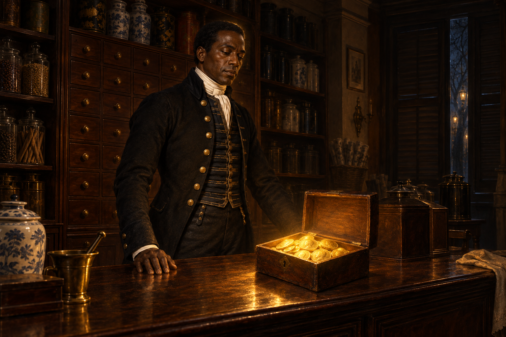

# 二十五枚幾尼照出的異樣

二十五枚來歷不明的幾尼，讓布記副食店的帳目突然多出無法解釋的盈餘。金幣的光把在場者照成與本性相反的模樣，桃木抽屜上的貨名也彷彿改成道德與命運的詞。史蒂芬走進光裡時，眉間聚起一圈近似王冠的光環，旁人卻都沒有察覺。

我在意這章把「價值」與「身分」都變成不可靠的讀數：金幣既可能是好事也可能帶來嫌疑，店員被光映出相反的性情，史蒂芬被加上一圈尊貴光芒，自己卻像隔著水觀看另一場戲。他帶著前一夜舞會後的疲憊走入光裡，這不是金幣來源或森林來歷的證據，而是日常秩序被悄悄翻面的感覺。

畫面停在布記鋪子的金光裡：幾尼散在櫃檯，光線掠過桃木抽屜，史蒂芬站在亮處與暗處的交界，疲憊而疏離。窗外的街燈與枝影彼此混淆，預告他將沿鐘聲走入樹林；不替金幣追出主人，也不把光環當成身分答案。

