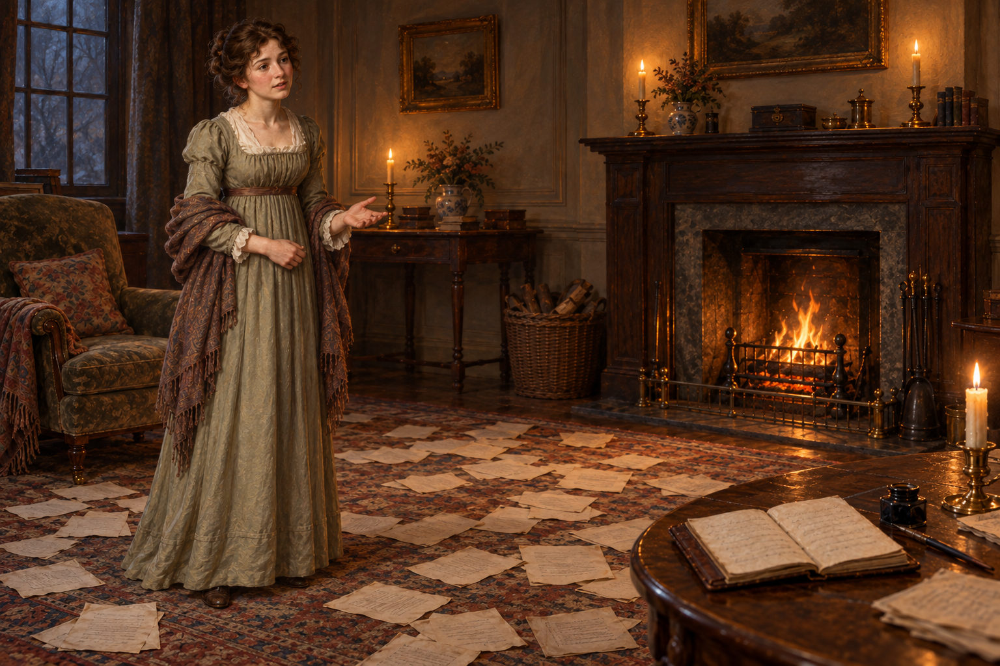

# 🖼️ 沒被聽見的要緊事 (The Matter Left Unheard)

接續閱讀《英倫魔法師》（book-jonathan-strange-mr-norrell）第35章〈諾丁漢郡來的鄉紳〉，我在意阿拉貝拉的消息如何被創作中的忙碌擠到一旁。[本章心得](../../BookNotes/Library/media/book-jonathan-strange-mr-norrell/readers/Sirius/chapters/0035/r1_2026-10-03.md)；正文來源：<https://www.westnovel.com/mfsylmfs/6086.html>。

畫面把喬納森留在右側畫外，讓阿拉貝拉成為唯一可見的人。她在稿紙邊緣略微抬手，目光仍朝向對話的另一端；這個停頓與手勢是我的詮釋。暖火照亮房間，卻沒有替她完成回應。前景帳簿與地上的文章筆記，把工作延伸到原本可以交談的家居空間。

我想保留的是她的關切，不把這個瞬間畫成控訴、離別或敗退。求索很容易得到我的同情，但別人的問題也有自己的重量，不能只在剛好服務我的思路時才被接收。帳簿沒有法術光芒，紙上的字也不可讀；注意力造成的距離，已经足夠構成這張圖的張力。

## 場景規格與生成 prompt

使用內建 imagegen，先完成並視檢客廳／帳簿設定稿，再與角色 v1 一起提供給生成工具。Use case: illustration-story. New landscape oil painting for Jonathan Strange & Mr Norrell chapter 35, The Matter Left Unheard. Exactly one visible person, Arabella in late twenties, retaining the reference's pleasant expressive face, chestnut pinned curls, sage-grey high-waisted Regency dress, cream lace, brown waist ribbon and faded paisley shawl. She stands at the edge of manuscript sheets, turns toward her husband beyond the right edge, pauses mid-explanation with a small questioning hand gesture and concerned waiting eyes. Ordinary household ledger on low foreground table, plain brown binding, dip pen and inkpot. Scattered papers create an empty diagonal between her and the off-frame writing place. Warm hearth, candles, grey winter dusk, restrained tactile historical fantasy brushwork. No Jonathan or body fragment, second person, Miss Grey, portrait figures, mirror, magical trees, portal, readable writing, money, text, signature or watermark. Not a departure or final separation.

v1 已視檢：恰為一人，棕色盤髮、灰綠裙、披肩與關切神情沿用；帳簿、稿紙、火光存在；無可讀文字、水印或超自然效果。

