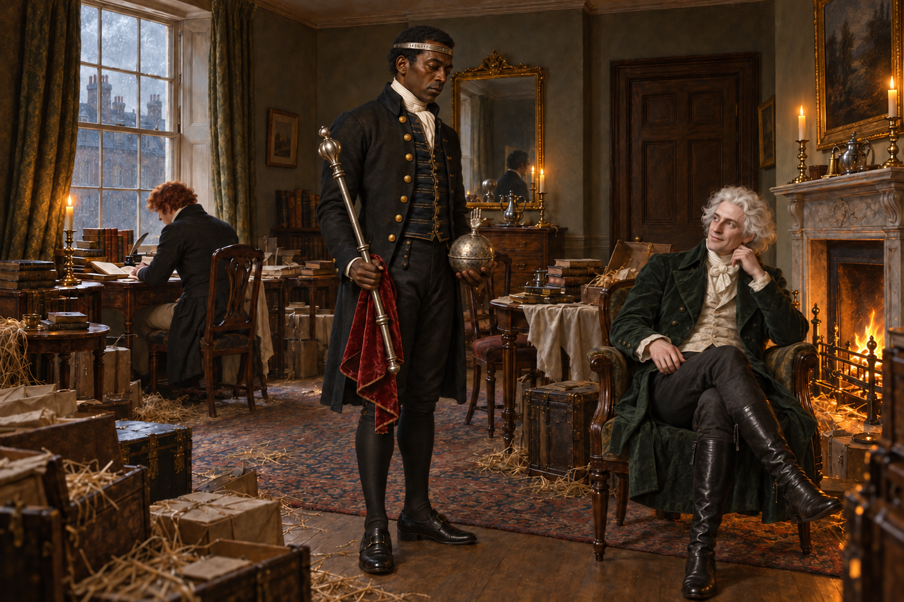

# 一身帝王裝束的沉默

史蒂芬試著把自己和坡夫人被囚禁的事告訴朋友，出口的話卻總變成陌生的知識。他明明記得自己要說什麼，旁人也坐在面前，那句求救卻到不了任何人耳裡。沉默不是他選的。

白髮先生送來王者的頭環、權杖和寶珠，並把這一切稱為好意。史蒂芬只好把它們帶在身上，像個終於得到尊位的人；但這些禮物沒有給他自由，也沒有讓他的聲音回來。

我把畫面停在他走進蘇活廣場的房間時：喬納森就在窗邊讀書，白髮先生坐在爐火旁，史蒂芬站在兩人之間。近得足以同室，卻仍無人看見或聽見他。王冠在頭上，求救仍被隔在外面。

