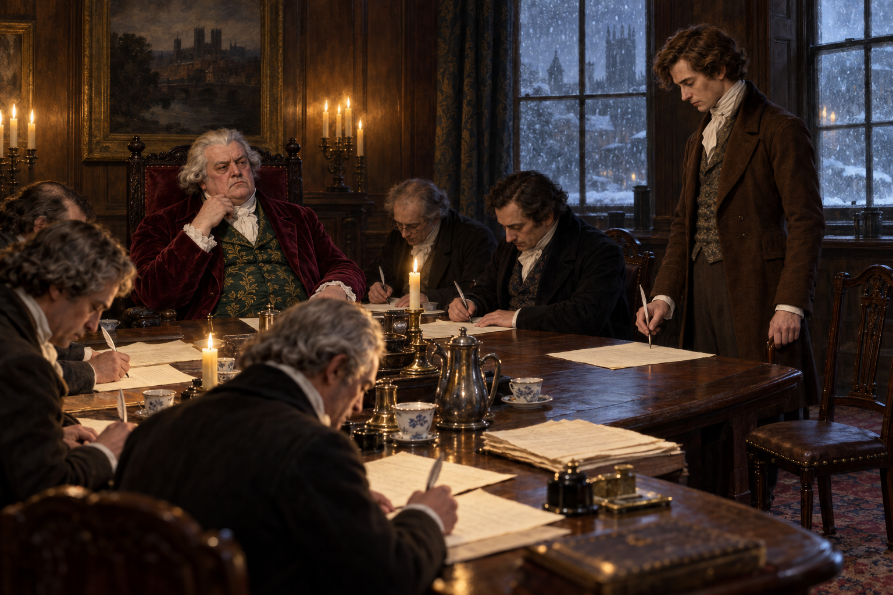

# 🖼️ 停在筆尖前的拒簽

古星酒棧裡的爭論把學術權威的焦慮變成一份有代價的協議：諾瑞爾若成功，約克魔法師協會便要解散。福克斯卡斯爾坐在桌首維持主席的體面，其他人用簽名把恐懼與虛榮固定在紙上，彷彿只要先把條款寫完，就能讓真正的魔法仍然只是別人的問題。

我把塞貢杜斯的筆停在紙面上方，而不是讓他離席或高聲抗議。這個小小的空隙比整張契約更有重量：他承認自己學問不足，卻不願用簽名放棄「魔法師」這個身分。拒簽不是勝利宣言，而是把代價清楚說出口後，仍保留最後一點自主。

因此畫面的魔法性來自未完成的動作。紙上沒有可讀文字，也沒有發光符文；真正改變場面的是一支尚未落下的羽筆，讓公共的決定在一個人的猶豫裡重新露出裂縫。

