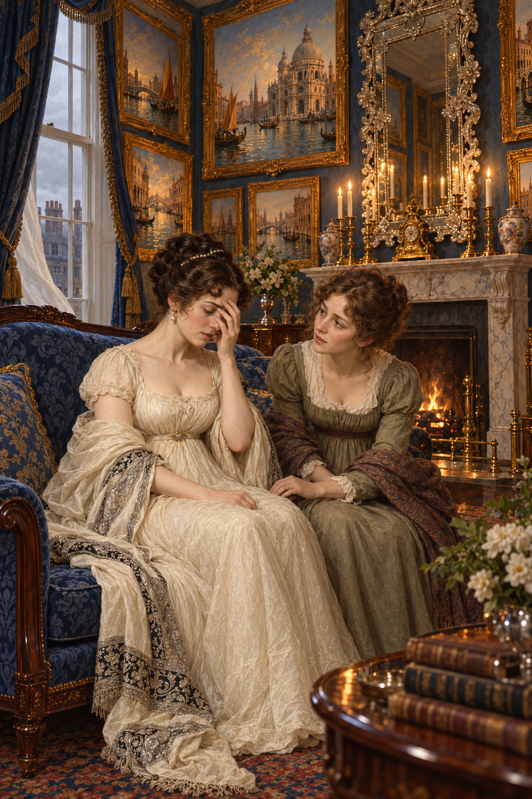

# 鏡中說不出的求援

阿拉貝拉在沃特爵士家的威尼斯畫室裡遇見坡夫人。坡夫人看起來清醒而平靜，卻告訴她自己寧願死，也不想再過現在的日子；當她試著說明諾瑞爾如何陷害自己，話語卻一次次變成她不想講的故事。說到一半，她掩住臉，認出那並不是自己的聲音。

我把畫面停在她停下來的那一刻。阿拉貝拉坐近一些，仍在認真聽；坡夫人的手遮住半張臉，象牙白披肩落在藍沙發邊。威尼斯油畫與鏡框把小房間照得明亮，方向卻像被畫框帶向看不清的岔路。

阿拉貝拉答應把她的話帶給喬納森，稍後又答應沃特爵士保密。兩份承諾都出於好意，最後卻讓她用常理判斷誰的話值得傳出去。我最難受的是，坡夫人好不容易找到一位願意聽她的人，求救仍卡在無法被她控制的敘述裡。

