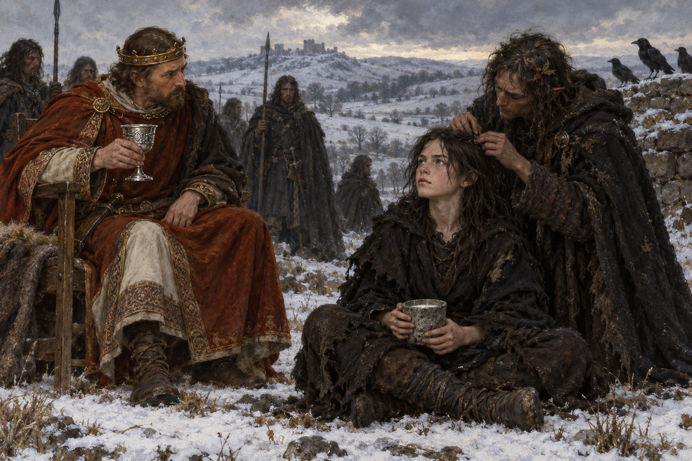

# 🖼️ 石杯與銀杯之間 (Between the Stone Cup and the Silver Cup)

來源為《英倫魔法師》第四十五章〈《英格蘭魔法的歷史與實踐》前言〉。斯特蘭奇記述亨利王與少年烏斯克格拉斯相會：國王坐在木椅上持銀杯飲酒，男孩坐在地上用石杯喝羊奶；仙軍士兵探身替他從頭髮裡捉虱子，令宮廷眾臣驚愕。

我讓兩只杯子和兩種坐姿先說明彼此的距離，再把捉虱子的動作放在少年身旁。這不是精靈王的神話肖像，而是一個被仙軍撫養、仍有普通身體的孩子走進政治談判。親密的照料沒有消除戰爭，卻讓「仙軍」不只是英格蘭人眼中的陌生敵軍。

這段歷史由斯特蘭奇寫在反駁諾瑞爾的前言裡。他把烏斯克格拉斯的魔法寫成人類調控與仙靈力量的結合，也寫下土地索賠與征服的代價；圖像沿用他的場景，但不替他的正當性判斷蓋章。

