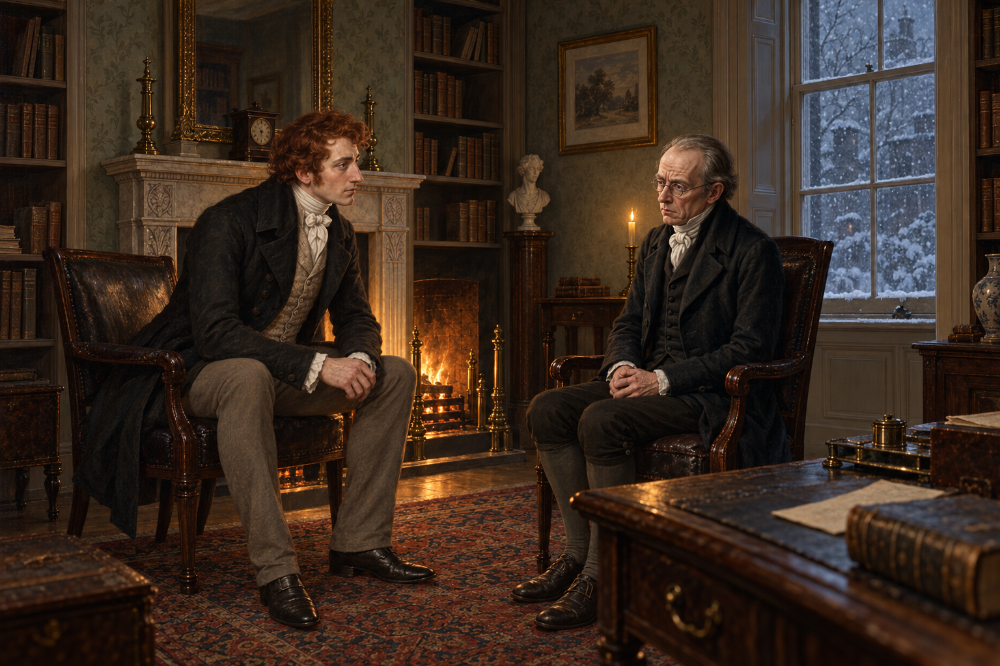

# 雪窗前被放輕的追問

冬日書房裡，諾瑞爾談到把法力寄存在戒指、石頭等物件。斯特蘭奇被雪利酒和爐火弄得昏昏欲睡，卻在聽見這些話時猛然清醒：老師幾週前才說過，魔法戒指和石頭都是無稽之談。

他沒有把這個矛盾變成質問，只是努力放平聲音，問自己是不是記錯了。諾瑞爾緊張起來；斯特蘭奇看見那份慌張，又重複說自己大概記錯，好讓談話能繼續。這份體諒護住了老師，也把學生拉進了老師的隱瞞。

我把畫面停在問題落下、答案還沒出口的空隙。窗外的雪和爐火讓書房顯得溫暖，兩人之間卻多了一道尚未說破的界線；不畫戒指、法術或稍後的故事。

